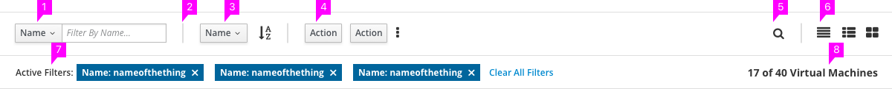
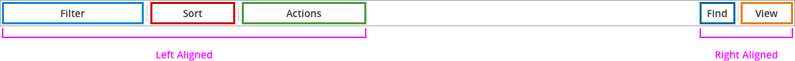

# Toolbar

  1. **Filter:** Enables a user to quickly reduce the number of content items on screen at one time by applying stackable filters to a content view.

  1. **Component Divider:** Visually and spatially separates the toolbar’s component patterns. No divider is needed between left-aligned and right-aligned sets of patterns because they are separated by a significant space.

  1. **Sort:** Helps users make sense of content by ordering it in a logical fashion based on a single attribute. Refer to the [Sort](http://www.patternfly.org/pattern-library/forms-and-controls/sort/#overview/) design page for more details.

  1. **Column Visibility:** Enables users to define what columns are visible within a table.
    - Only displays for the table view. If the user changes the view to something other than the table view, then this icon does not display in the toolbar. Refer to the [Table View](http://www.patternfly.org/pattern-library/content-views/table-view/) design page for more details.
    - If Sort controls are included in the toolbar, then this icon displays in the same control group as Sort and is the last item in this group. If sort controls are not included, then the this icon displays in the same position that is shown for the Sort control group in the [Layouts](#layouts) section below.

  1. **Actions:** Contains actions for one or more pieces of content in the current view.

  1. **Find:** Locates a specific item or items by automatically scrolling or paging to all occurrences of an entered query. Unlike filtering, it does not remove content from the view.

  1. [**View Selector:**](http://www.patternfly.org/pattern-library/forms-and-controls/view-selector/) The View Selector allows the user to switch between different views of the same data set.

  1. **Active Filters:** A component of the filter tool that contains a list of all currently active filters as well as the Clear All Filters action. Not displayed if stackable filters are disabled.

  1. **Content and Results Count:** Shows the number of content items that satisfy all currently applied filters, as well as the total number of items and the type of item. If no filters are applied, only the total number of items and the item type are displayed (e.g. 40 Virtual Machines). May be displayed to the left of right-aligned content if stackable filters are disabled.

## Layouts

The Toolbar can take different shapes depending on which content controls are included.

The content controls should be arranged according to the above templates. If one or more component patterns are not needed, the remaining patterns should align to the edge of the toolbar rather than leaving an empty space for the missing pattern.

## Icons and Tooltip text
To support accessibility, icon buttons that display in the toolbar should include tooltip text using the [Tooltip widget](http://www.patternfly.org/pattern-library/widgets/#tooltip) and screenreader text using the `aria-label` attribute. The [Tooltip widget](http://www.patternfly.org/pattern-library/widgets/#tooltip) supports keyboard accessibility, whereas the html `title` attribute does not.

The following text is recommended for the set of icons displayed in the example above.

| Icon                                      | Class Name    | Tooltip Text      | Screenreader Text (aria-label) | Comments                   |
| ----------------------------------------- | ------------- | ----------------- | ------------------------------ | -------------------------- |
|       | fa-sort-alpha-asc   | Sort A to Z       | Sorted A to Z. Toggle to sort Z to A. | Displays in the Sort control group (see callout 3). This icon and text would display regardless of data type. The icon and text use "A to Z" as an example to communicate sort order, and are not intended to indicate type of data that displays in the selected column. Refer to the [Sort](http://www.patternfly.org/pattern-library/forms-and-controls/sort/#design) design page for more details of available sort icons and when they should be used. |
|      | fa-sort-alpha-desc  | Sort Z to A       | Sorted Z to A. Toggle to sort A to Z. | Displays in the Sort control group (see callout 3). See comments in previous row. |
|         | fa-column     | Show/hide columns | Show/hide columns              | Displays in the Sort control group (see callout 4) |
|     | fa-ellipsis-v | More actions      | More actions                   | Displays in the Actions control group (see callout 5) |
|         | fa-search     | Find              | Find                           | Displays in the Find control group (see callout 6) |
|             | fa-th         | Table view        | Table view                     | Displays in the View control group (see callout 7) |
|       | fa-th-large   | List view         | List view                      | Displays in the View control group (see callout 7) |
|        | fa-th-list    | Card view         | Card view                      | Displays in the View control group (see callout 7) |
|  | pficon-close  | [none]            | Clear filter                   | Displays in the Active Filters row (see callout 8). Tooltip text is not needed for the X icon since the action associated with X is more obvious to users. However, screenreader text is still needed. |
{:.table .table-striped .table-bordered}
