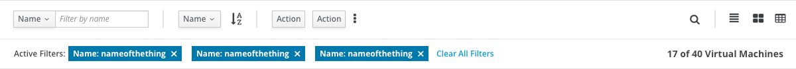
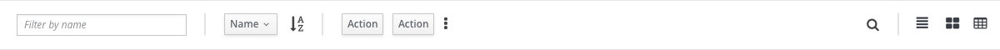
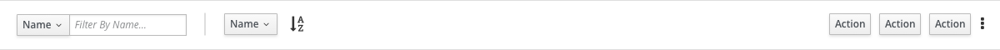
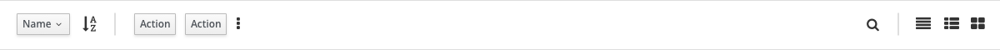

# Toolbar

The Toolbar pattern sits above a content view such as a [List View](https://www.patternfly.org/pattern-library/content-views/list-view/#/api), [Card View](https://www.patternfly.org/pattern-library/content-views/card-view/#/api) or [Table View](https://www.patternfly.org/pattern-library/content-views/table-view/#/api). The Toolbar provides a framework for a number of content control patterns including, but not limited to:
- Filter
- Sort
- Actions
- [Find](https://www.patternfly.org/pattern-library/forms-and-controls/find/#_)
- Change View

These controls may be used either together or individually, and may be substituted for other components. The Toolbar pattern should be used any time controls are needed for a content view.

### Toolbar With All Components

### With Alternate Filter

### Without Find and Change View

### Without Change View

### Without Filter

