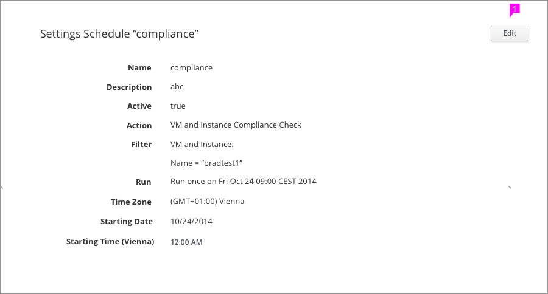
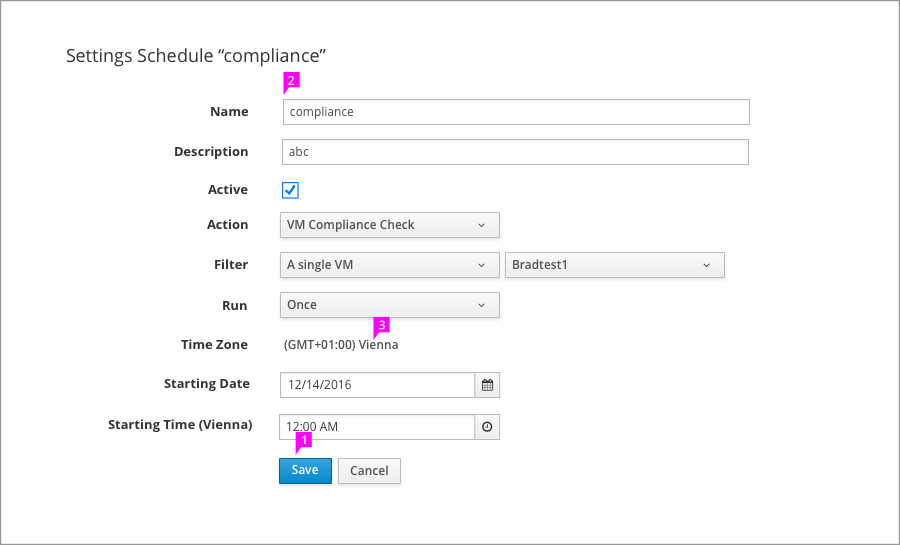

# View mode / Edit mode

## View mode

 - The "Edit" button has been put in the top right corner. Horizontal center align with the title.

 - Use default button style for edit button. In view status, it doesn't take to much visual noise that influence user reviewing the form contents.

## Edit mode

 - In edit mode, the "Edit" button will be hidden. The operation buttons such as "Save" and "Cancel" will be in the bottom of form.
 - After clicking the operation buttons, the page will return to view mode.
