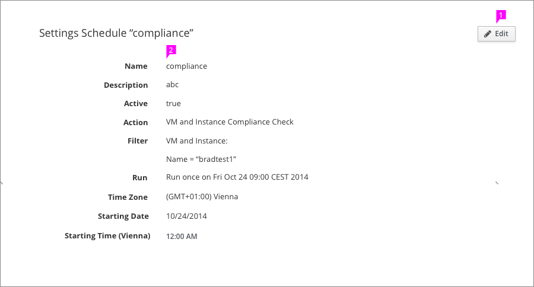

# View mode / Edit mode

## View mode

 1. The "Edit" button not fix in the top right corner.
Please put it in the place highlighted and looks balanced in the page. It usually in the top of the form information.
 1. Just show the text information in form content section. Without click "edit" button. User can not edit anything in this part.

## Edit mode

 1. In edit mode, the "Edit" button will be hidden. The operation buttons such as "Save" and "Cancel" will be show in the bottom of form.
 1. After click "edit" button, the content part will be changed to form. User can do the edit operation in the form.  After clicking the operation buttons, the page will return to view mode.
 1. If the data don't allow user to edit, it will be displayed in text. (eg. Time Zone)
