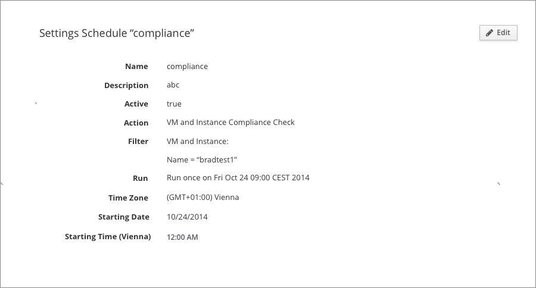

# View mode / Edit mode

## Overview
View mode / Edit mode is a high frequency of usage scenarios in form design. The view mode is used for protecting data incase misoperation from users. The edit mode helps user quick edit the date in the form.
The two modes are cooperate with each other.

## Examples

