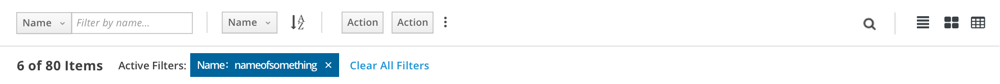
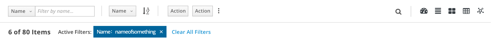
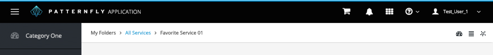

# View Selector

Possible View Selector icons are listed below and may be used in any combination when two or more view types are supported. When used, icons should appear in the order indicated.

1. **Overview** - fa-tachometer
2. **List View** - fa-align-justify
3. **Card View** - fa-th-large
4. **Table View** - fa-table
5. **Topology View** - pficon-topology

### View Selector in Toolbar ###
View Selector icons are always placed in the top right corner. Example with three icons.

Example with all five icons.

### View Selector in Breadcrumb ###

