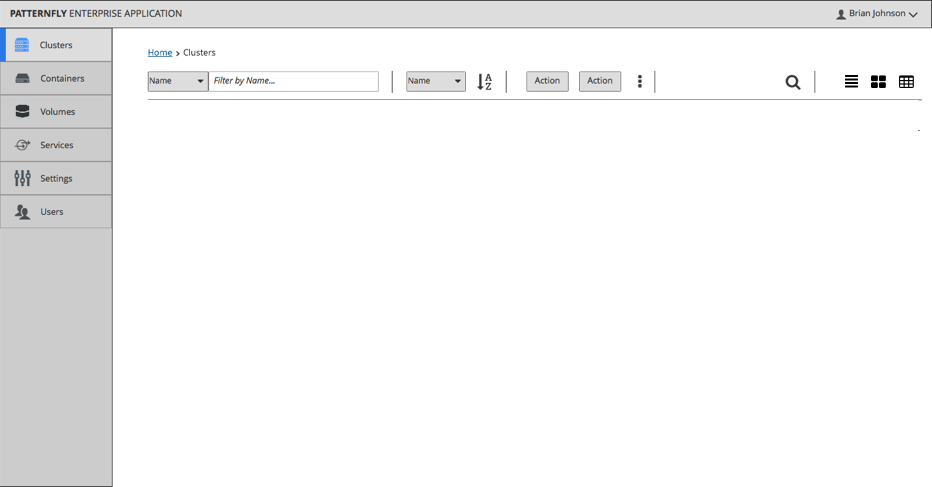

# View Selector

The view selector is located in a toolbar providing views for a [List View](https://www.patternfly.org/pattern-library/content-views/list-view/), [Card View](http://www.patternfly.org/pattern-library/content-views/card-view/) or [Table View](http://www.patternfly.org/pattern-library/content-views/table-view/).

View selector icons should be placed in this order (1) List View (2) Card View (3)Table View - optional.

### View Selector Detail

