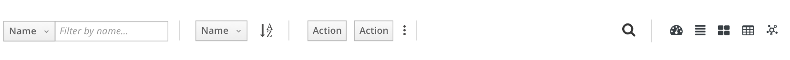

# View Selector

A view selector is used to allow the user to visualize data differently by toggling between supported view types.

The following is a list of recommended view types which can be utilized as needed:

1. Overview (dashboard view of an object or a group of objects)
2. List View
3. Card View
4. Table View
5. Topology View

### View Selector Detail

