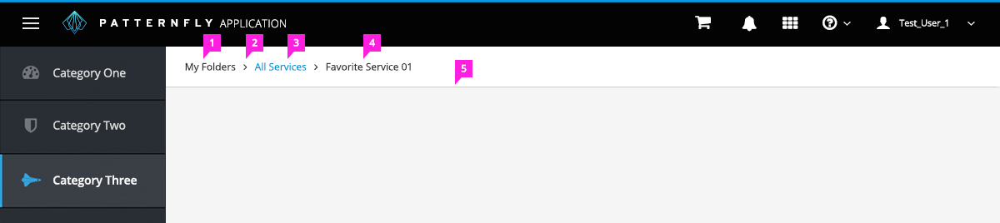
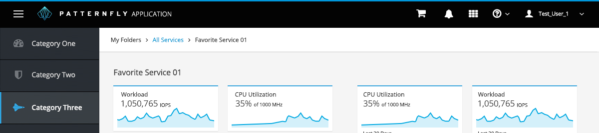
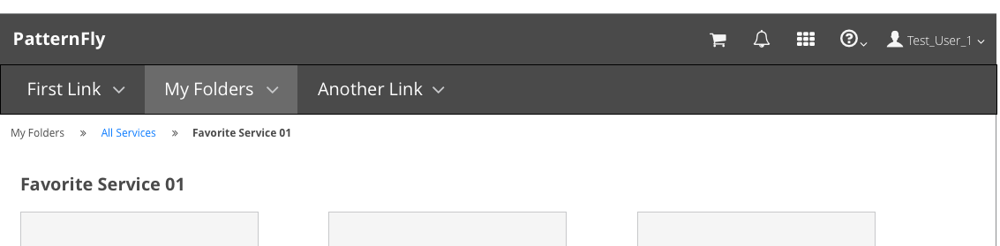
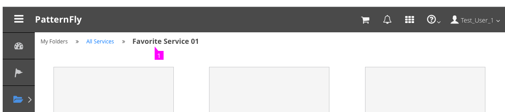

# Breadcrumbs

  1. **Primary Navigation Item:** The primary navigation item should always be the first item listed in the breadcrumb string. If the primary navigation items do not have a landing page, this item should not be listed as a link.
  2. **Icon:**  The "fa-angle-double-right" Font Awesome icon should be used to separate levels in the breadcrumb string.
  3. **Links:** All drill down pages that the user can navigate back to, should be shown as links in the breadcrumb string. The underline should appear when the user hovers over a link.
  4. **Current Location:** The end of the breadcrumb string should represent the page a user is currently viewing. This string should be bold text and should not be a link.

## Vertical Navigation Example

## Horizontal Navigation Example

When secondary navigation items are hidden, breadcrumbs may be used in conjunction with horizontal navigation.

## Example with Optional Page Title

1. **Current Location:** The end of the breadcrumb can also play the role of page title in an effort to conserve vertical space. If this format is used, it should be carried out for all breadcrumb instances in an application.
