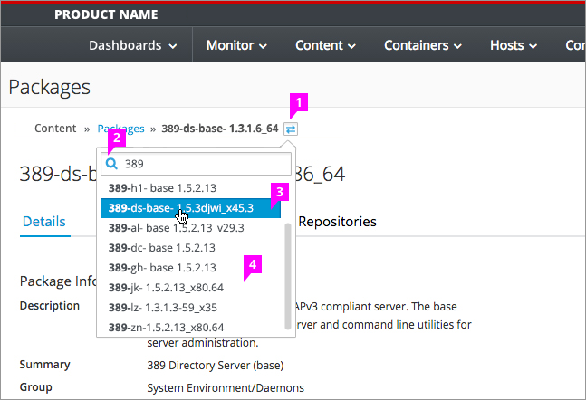
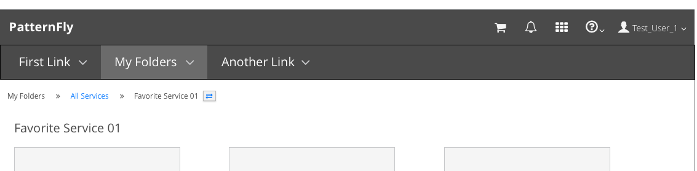
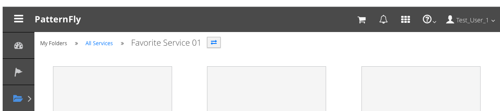

# Breadcrumbs

  1. **Primary Navigation Item:** The primary navigation item should be the first item listed in the breadcrumb string. If the primary navigation items do not have a landing page, this item should not be listed as a link.
  2. **Icon:**  The "fa-angle-double-right" Font Awesome icon should be used to separate levels in the breadcrumb string.
  3. **Links:** All drill down pages that the user can navigate back to, should be shown as links in the breadcrumb string. The underline should appear when the user hovers over a link.
  4. **Current Location:** The end of the breadcrumb string should represent the page a user is currently viewing. This string should be bold text and should not be a link.
  5. **Divider** (optional): A horizontal divider may be present below the breadcrumbs depending on the page layout used inside an application. If this format is used, it should be used consistently throughout the application.

#### Vertical Navigation Example

#### Horizontal Navigation Example

When secondary navigation items are hidden, breadcrumbs may be used in conjunction with horizontal navigation.

## Breadcrumbs Combined with Page Title (Optional)

1. **Current Location:** The end of the breadcrumb can also play the role of page title in an effort to conserve vertical space. This option would include use of a larger font for the end of the breadcrumb string. If this format is used, it should be used consistently throughout the application.

## Breadcrumb Switcher (Optional)
The Breadcrumb Switcher provides a shortcut for users to quickly navigate to parallel pages, rather than navigating back to the previous page and making a new selection. In the example below, users can either go back to the "Packages" page to select a new item or they can remain in the details view shown, and use the switcher to jump from one item to the next.

1. **Icon:** The "fa-exchange" Font Awesome icon should be placed to the right of the breadcrumb string to allow users to access the Switcher.
2. **Search** (Optional):
  - A search bar can be available at the top of the dropdown list with the "fa-search" icon on the left side of the bar.
  - Searching will allow users to narrow down the list of results to display only matching items.
  - The matching piece of the results should appear in bold text.
  - **Note:** If the searchable list is paginated in other areas of the application, ideally this search would look across ALL pages to find matching results. For example, in this case all "Packages" should be park of the search.
3. **Hover State:** A hover state should be shown visually when a user hovers over an item in the list.
4. **Dropdown List:** Clicking the switcher icon should open a panel with the list of items parallel to the one displayed on the current page. When an item is selected from the list, users will be navigated to a new page.

#### Example with Breadcrumb Switcher

#### Example with Breadcrumb Switcher and Page Title

