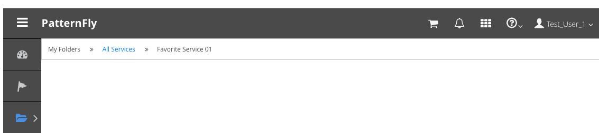

# Breadcrumbs

Breadcrumbs display a users location within an application hierarchy. They act as a resource to help users navigate more efficiently and provide additional context.

Breadcrumbs do not replace the back button for web applications and should not be used to display how a user navigated. These are location breadcrumbs that help expose the hierarchy, not the particular clicks of a user.

Breadcrumbs are recommended when the primary and secondary navigation items are not always exposed. For example, breadcrumbs will enhance an application that uses vertical navigation or one that uses horizontal navigation where secondary menus are hidden. When using breadcrumbs, be sure to include them on every page throughout the application.

Breadcrumbs are NOT meant to be an alternative to displaying [Vertical Navigation](http://www.patternfly.org/pattern-library/navigation/vertical-navigation/#_) or [Horizontal Navigation](http://www.patternfly.org/pattern-library/navigation/horizontal-navigation/#_).

