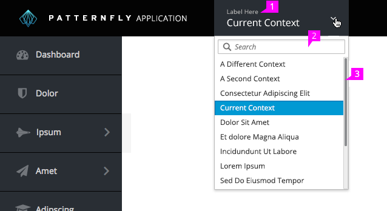
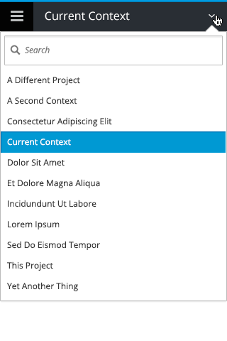

# Context Selector

## Dropdown Details

1. If there is a search bar, it should be at the very top of the menu.
1. If there are many items (i.e. more than 12), the dropdown should scroll and a search field should be added to filter the list as the user types.

### Responsive Behavior

- Because the context identifies what is in the UI, the Context Selector should remain visible at smaller viewports.
- Product branding should be dropped in favor of keeping the context visible.
- If the product branding served as navigation, that navigation item should be added to the hamburger menu.

### Truncation
Context names may need to be truncated if the names are very long, or if horizontal space is tight. Names should be truncated in a way that makes sense for the product or application. See PatternFly’s guidelines on [truncation](http://www.patternfly.org/styles/terminology-and-wording/#truncation).
