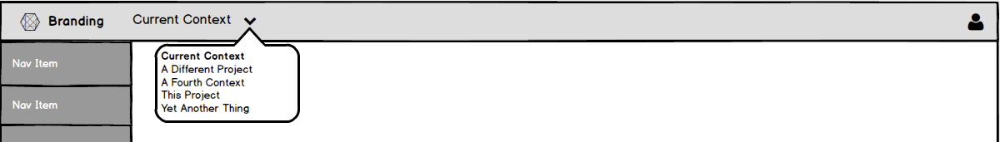
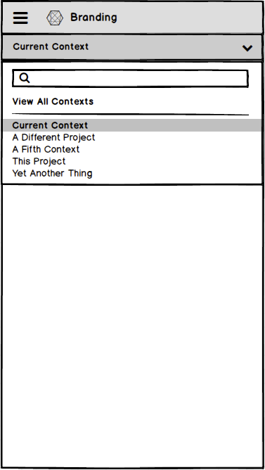
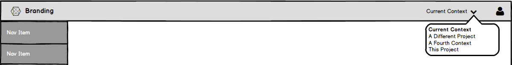

# Context Selector

## Dropdown Details

1. If the context names are user-generated, a label should be included about the selector.
1. If there are any actions that are not part of the context list, they should appear above and separated from the actual list of contexts.
1. The currently selected project should appear at the top of the list.
1. If there are many items (i.e. more than 12), the dropdown should scroll and a search field should be added to filter the list as the user types.
1. If there is a search bar, it should be at the very top of the menu.

## Left side of masthead

### Responsive Behavior

Because the context identifies what is in the UI, the Context Selector should remain visible at smaller viewports.

## Right side of masthead

When the Context Selector is in the right side of the [Masthead](http://www.patternfly.org/pattern-library/application-framework/masthead/#/design), it should be the left-most item, grouped with any other product-specific items.

### Responsive Behavior
At smaller viewport sizes the Context Selector will move into the hamburger menu along with other masthead utilities. The dropdown items will be displayed as secondary navigation items.
