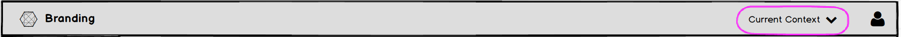
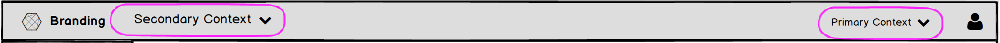

# Context Selector

## Overview

The Context Selector is used when the data/resources shown in the UI are dependent on context. It is useful when the UI cannot show data for multiple contexts simultaneously, or when it makes sense not to. Different contexts within a product should share the same navigation, but will differ in the data shown. Examples of contexts could include concepts such as region, project, or organization, but the specific notion of context is defined by the individual product.

The context selector may appear as a dropdown in either the left or right side of the [Masthead](http://www.patternfly.org/pattern-library/application-framework/masthead/), as determined by the specific use case.

This pattern should NOT be used:
- When there is a need to select more than one context within a single layer of context (multiselect).
- As a shortcut for other navigation items.
- To navigate to a different “product area” different navigation options/features. For that use case, consider the [Launcher](http://www.patternfly.org/pattern-library/application-framework/launcher/).

## Use Cases

### Context Selector on the Right Side

If the UI is about the context itself, or if users will be changing contexts often, the selector should be placed on the left side of the masthead, near the application branding.

### Context Selector on the Right Side

The context selector should appear in the right side of the masthead if the data/actions in the UI are not about the context itself, or if changing contexts is not an action users are likely to perform often.

### Multiple Layers of Context

The context selector acts on a single layer of context, but products may define multiple layers. In this case, multiple selectors may be used.
