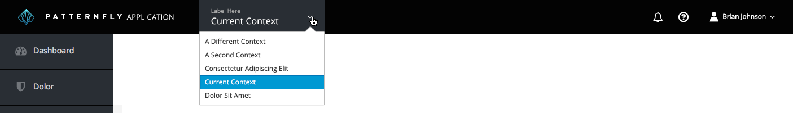

# Context Selector

## Overview

The Context Selector is used when the data/resources shown in the UI are dependent on context. It is useful when the UI cannot show data for multiple contexts simultaneously, or when it makes sense not to. Different contexts within a product should share the same navigation, but will differ in the data shown. Examples of contexts could include concepts such as region, project, or organization, but the specific notion of context is defined by the individual product.

The context selector should appear as a dropdown in the [Masthead](http://www.patternfly.org/pattern-library/application-framework/masthead/), next to the application branding.

This pattern should NOT be used:
- When there is a need to select more than one context within a single layer of context (multiselect).
- As a shortcut for other navigation items.
- To navigate to a different “product area” with different navigation options/features. For that use case, consider the [Launcher](http://www.patternfly.org/pattern-library/application-framework/launcher/).
