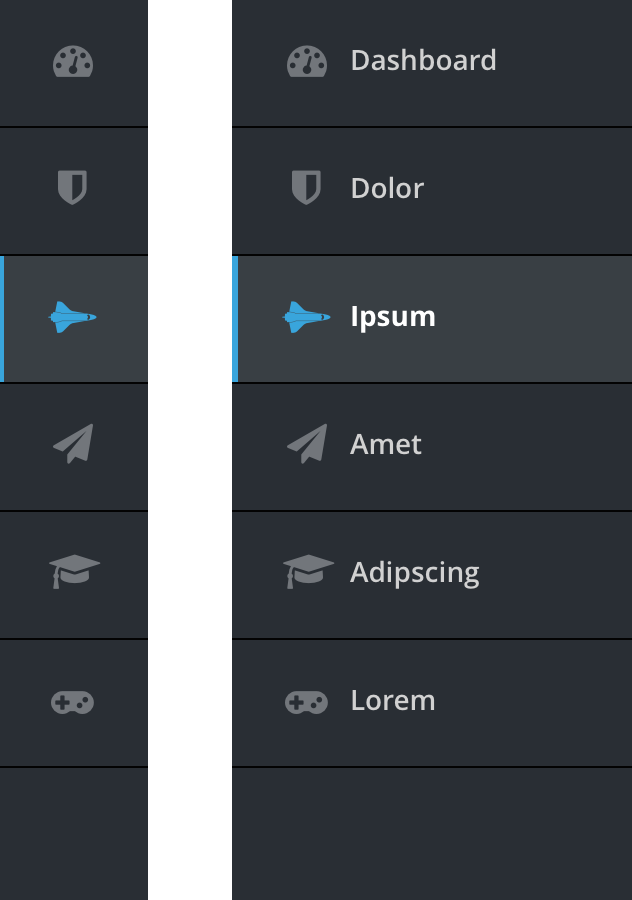
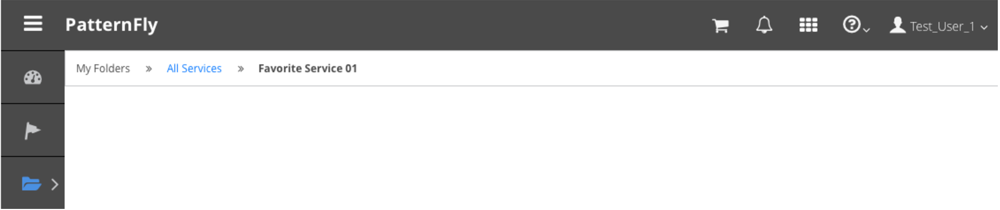

## A Guide to PatternFly Navigation
There are a number of different solutions that we support in PatternFly with respect to navigation. Choosing which one works best really depends on the application you are designing and developing. Here are some guidelines around which type of navigation solutions we suggest, why, and when.

Jump to [Masthead (Branding & Application Level Navigation)](#masthead-branding-application-level-navigation), [Horizontal vs. Vertical Navigation](#horizontal-vs-vertical-navigation), [Breadcrumbs (Drill Down to Details)](#breadcrumbs-drill-down-to-details), or [Responsive Navigation](#responsive-navigation).

## Masthead (Branding & Application Level Navigation)
The masthead serves as a place where overall branding and application level navigation should live. We recommend two different types of masthead design.

Consider a [Short Masthead](http://www.patternfly.org/pattern-library/application-framework/masthead/) when:
* There is a concern about saving vertical space.
* Horizontal navigation is being used.

Consider a [Tall Masthead](http://www.patternfly.org/pattern-library/application-framework/masthead/) when:
* The product needs to support rebranding.
* Vertical navigation is being used.

## Horizontal vs. Vertical Navigation
People seem to like to make this out to be a battle but really, there are specific reasons when you’d want to use one versus the other.

Consider [Hortizonal Navigation](http://www.patternfly.org/pattern-library/navigation/horizontal-navigation/) when:
* Horizontal space is a concern. Horizontal navigation takes up a bit of vertical space, but under that there is the entire width for any content. Overall, horizontal navigation can take up less space than vertical. If a typical user won’t have a wide enough screen, vertical navigation can take up a lot of that space and horizontal navigation should be considered.

Consider [Vertical Navigation](vertical-nav.md) when:
* Vertical space is a concern. Vertical navigation takes up horizontal space, but vertical space is preserved for more content to the right of the navigation.
* A larger number of primary navigation items exist. Vertical navigation scales better than horizontal navigation moving left to right.
* Icons for each primary navigation item will be used. This is another scale concern, but can also benefit the space used by vertical navigation by allowing the user to toggle the words off and save space by just showing the icons in the navigation bar.
* Switching between desktop and mobile is a planned use case. Vertical menus more readily adapt to small screen sizes. While horizontal menus can also be made responsive, it usually requires a transformation from horizontal to vertical. Since vertical menus are already in this format, the transition from desktop to mobile is less disorienting.

## Breadcrumbs (Drill Down to Details)
One type of navigation comes up when a user wants to drill down even further from the main navigation into object details.

Consider [Breadcrumb Navigation](http://www.patternfly.org/pattern-library/navigation/breadcrumbs/) when:
* Displaying a users location within an application hierarchy is desired. Breadcrumbs act as a resource to help users navigate more efficiently and provide additional context.
* The primary and secondary navigation items are not always exposed.
* Breadcrumbs are NOT meant to be an alternative to displaying [Vertical Navigation](http://www.patternfly.org/pattern-library/navigation/vertical-navigation/) or [Horizontal Navigation](http://www.patternfly.org/pattern-library/navigation/horizontal-navigation/).

## Responsive Navigation
As the screen real estate gets smaller, we are making a few recommendations when it comes to supporting a responsive navigation:
* **Small Screen (From 768 to 1200px):** In all cases, the secondary navigation, if one exists, will replace the primary menu in a one column layout (same 	interactions as full-width without icons).
* **Mobile (less than 768 px):** Navigation is hidden under “hamburger” icon.

