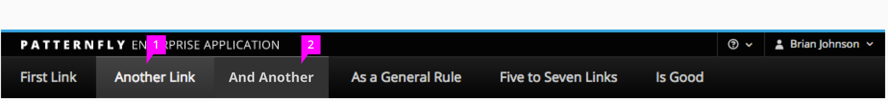
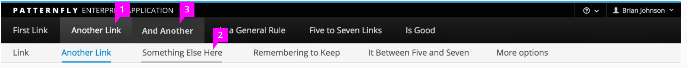
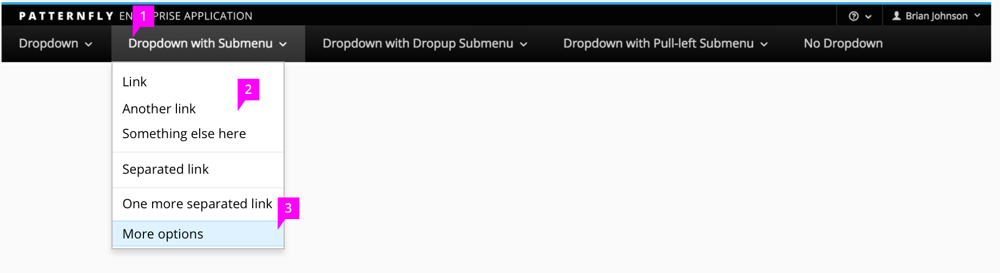

Jump to [Masthead Design](#masthead-design), [Single-Level Menu Bar](#single-level-menu-bar), [Two-Level Menu Bar](#two-level-menu-bar), or [Menu Bar with Drop-Downs](#menu-bar-with-drop-downs).

## Masthead Design
There are two options for the [Masthead](https://www.patternfly.org/pattern-library/application-framework/masthead/#_) design, one short option to save space and one tall option to accommodate for larger product logos. The short masthead option is recommended when using horizontal navigation.

## Single-Level Menu Bar

The Single-Level Menu Bar is the default navbar, all other options are added to this basic pattern.

1. **Menu Item - Selected**: The current selection will be highlighted to indicate the current page. There will be a current selection at all times. When an application is opened, the first (left-most) item will be selected by default.
2. **Menu Item - On-Hover**: Hover state provides feedback that menu items are active.

## Two-Level Menu Bar

When a second level of persistent navigation is needed, add a second tier of links.

1. **Secondary Menu Item Selected**: Show the selected state of both the primary and secondary menu items to tell the user where they are in the hierarchy. By default the first (left-most) item in both menus is selected.
2. **Secondary Menu Item On-Hover**: Hover state provides feedback that menu items are active.
3. **Primary Menu Item On Hover**: When the user hovers over a new primary menu item, the contents of the secondary menu will update to display secondary menu options associated with this item.

## Menu Bar with Drop-Downs

Add a drop-down menu to a single menu bar to expose a vertical list of sub-categories that the user can select from. Note that when drop-down menus are used, all categories are not required to have secondary navigation. The drop-down menus only support up to two levels of navigation. If you need the tertiary navigation, [Vertical Navigation](http://www.patternfly.org/pattern-library/navigation/vertical-navigation/) is the preferred choice over horizontal navigation.

1. **Primary Menu Item**: Any primary item that supports a secondary level of navigation will add a down-caret icon to indicate that a drop-down menu exists. The primary item will display its selected state when any secondary page within that branch is selected. This will provide the user feedback about which primary section they are working in. When an application is initially opened, the first secondary page within the first section will be opened, by default.
2. **Drop-Down Menu**: Single-clicking a primary item opens the drop down. Clicking anywhere outside of the menu will dismiss it.
3. **Drop-Down Menu On Hover and Selected**: The drop-down menu items have hover and selected states. Hover state provides feedback that menu items are active. Clicking this item navigates to a new page and dismisses the menu.
