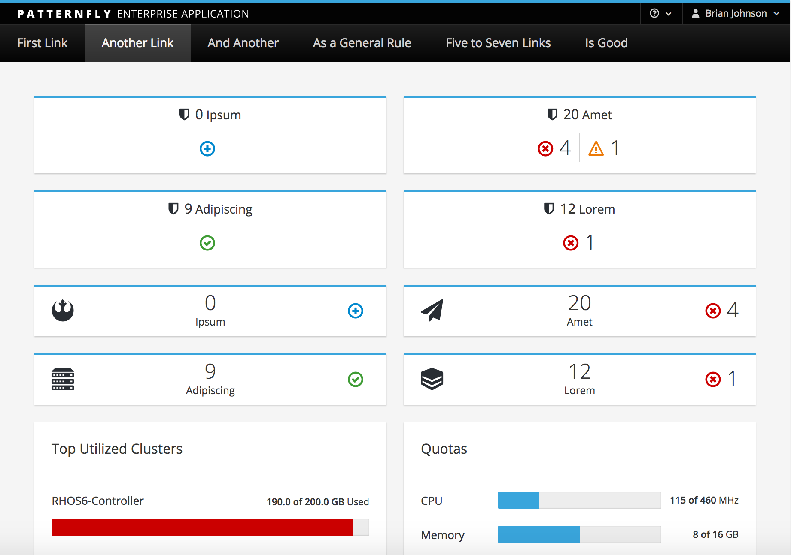

It is recommended to use horizontal navigation when your application requires global navigation that is displayed always at the top.
The horizontal navigation pattern supports up to two levels of navigation( Primary and Secondary).

* **Primary level navigation** - The primary level navigation should always be exposed.
* **Secondary navigation** - The secondary level can either be persistent or hidden within dropdown menus. The latter provides less visibility to lower-level categories but saves vertical screen space.

As a rule of thumb, the horizontal navigation is the preferred choice over [Vertical Navigation](http://www.patternfly.org/pattern-library/navigation/vertical-navigation/) when:
* There are a small number of fixed categories. You want to provide the best visibility to primary categories by placing them immediately below the page header area.
* Consider using [Vertical Navigation](http://www.patternfly.org/pattern-library/navigation/vertical-navigation/) if you need a solution that can easily scale for a large amount of menu items and easily adapt to small screen sizes.
* Horizontal menus can also be made responsive but it usually requires a transformation from horizontal to vertical. Since vertical menus are already in this format, the transition from desktop to mobile is less disorienting.

When using this pattern with the [Notification Drawer](http://www.patternfly.org/pattern-library/communication/notification-drawer/#/api), it is recommended to use the sticky horizontal navigation so that the navigation and notification drawer stick to the top of the page on scroll.

Jump to [Masthead Design](#masthead-design), [Standard Horizontal Navigation](#standard-horizontal-navigation), or [Navbar Variations](#navbar-variations).

## Masthead Design
The horizontal navigation is recommended to use the the short masthead in order to reduce the vertical real estate.

## Standard Horizontal Navigation

[View full page example](http://www.patternfly.org/pattern-library/navigation/horizontal-navigation/horizontal-navigation.html)

## Navbar Variations

### Single-Level Menu Bar

### Two-Level Menu Bar

### Menu Bar with Dropdowns

