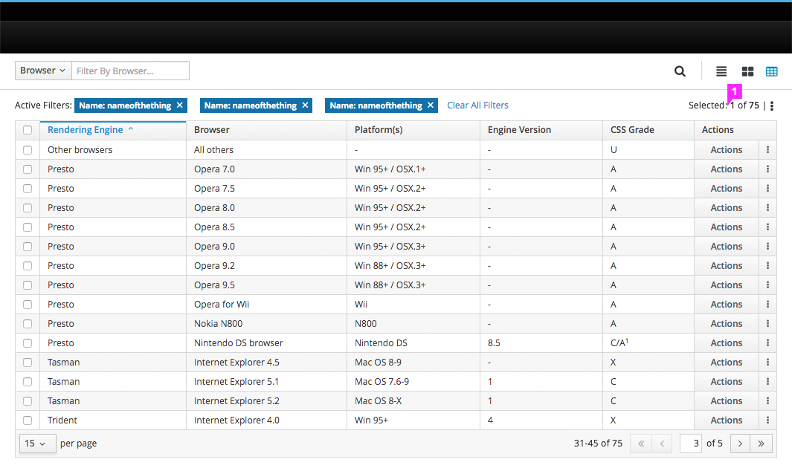

# Pagination

1. **Items per Page:** This control displays the number of items on a page.
  * It includes an option to modify the number of items displayed. It is recommended that the default number be less than 25 in order to minimize scrolling.
2. **Items Displayed:** This control displays the number of items currently in view.
3. **Navigate Pages:** These controls allow the user to navigate to the previous or first page.
4. **Current Page:** This control display the current page and allows users to navigate to a specific page.
5. **Total Pages:** This count displays the total number of pages.
6. **Navigate Pages:** These controls allow the user to navigate to the next or last page.

## Pagination - Selection Pattern

### Default View

### Filters Applied

1. **Filters:** Filters are displayed on left side.
2. **Item Count:** An updated item count is displayed on the right side.

### Single Select

1. **Select:** Select single items by checking the box on the left of each item row.

### Multi-Select

1. **Select All:** Select all items within a single page by checking the box in the column header.

### Select All

1. **Select All:** Select all items within the table by clicking Select All link.

### Clear All

1. **Clear All:** Clear any selected items by clicking Clear All link.

### Selection While Paging

1. **Select:** Items remain selected even as a user pages.

## Pagination - Content Below

1. **Content Below:** A sticky footer is not recommended for views with content *below* pagination.
2. **Items per Page:** It is recommended that the default number of items displayed be less than 25 in order to minimize scrolling.
  * Allowing users to change the default number should be optional.
