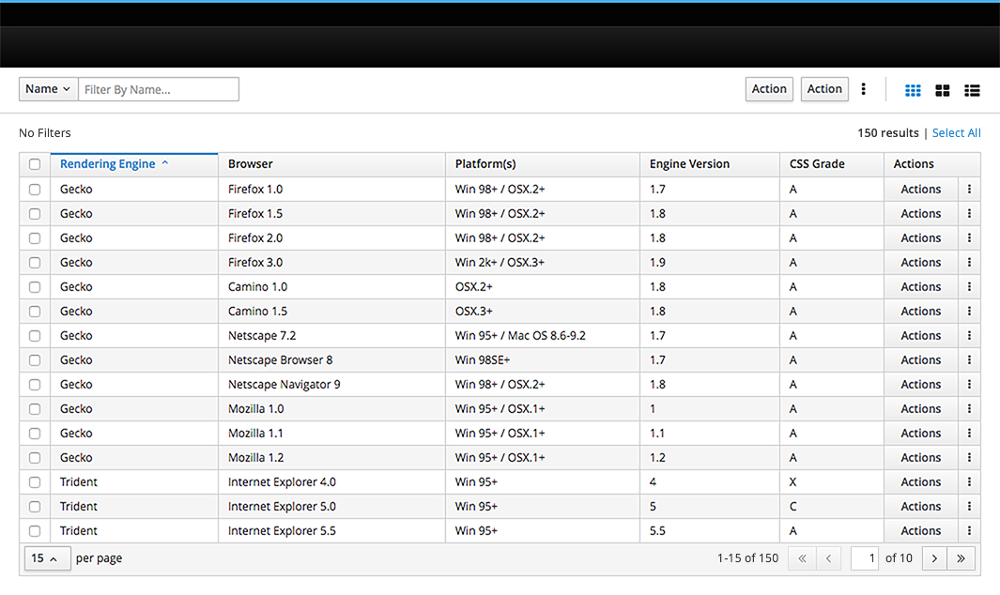
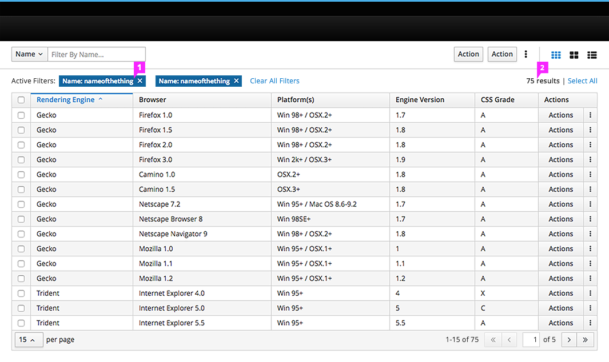
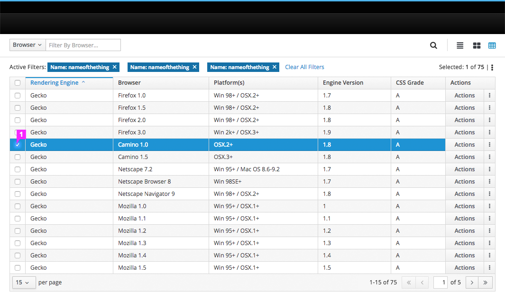
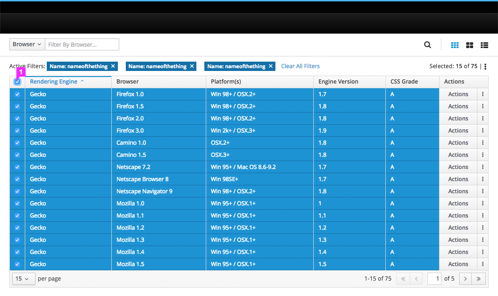

# Pagination

## Pagination Elements

1. Number of items on a page
  * Includes option to modify the number of items displayed. It is recommended that the default number be less than 25 in order to minimize scrolling.
2. Items currently displayed
3. Navigate to the previous or first page
4. Current page / navigate to specific page
5. Total number of pages
6. Navigate to the next or last page

## Pagination - Selection Pattern

### Default View

### Filters Applied

### Single Select

1. Select single items by checking the box on the left of each item row.

### Multi-Select

1. Select all items within a single page by selecting the checkbox in the column header.

### Select All

1. Select all items within the table by clicking Select All link.

### Clear All

1. Clear any selected items by clicking Clear All link.
