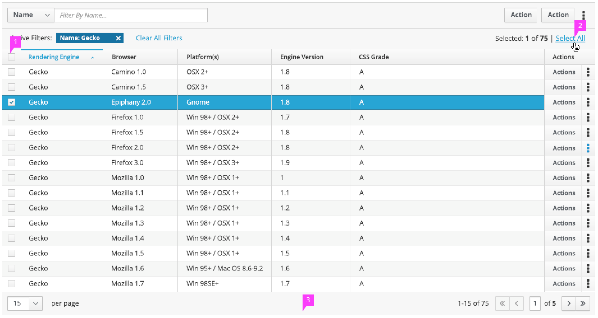
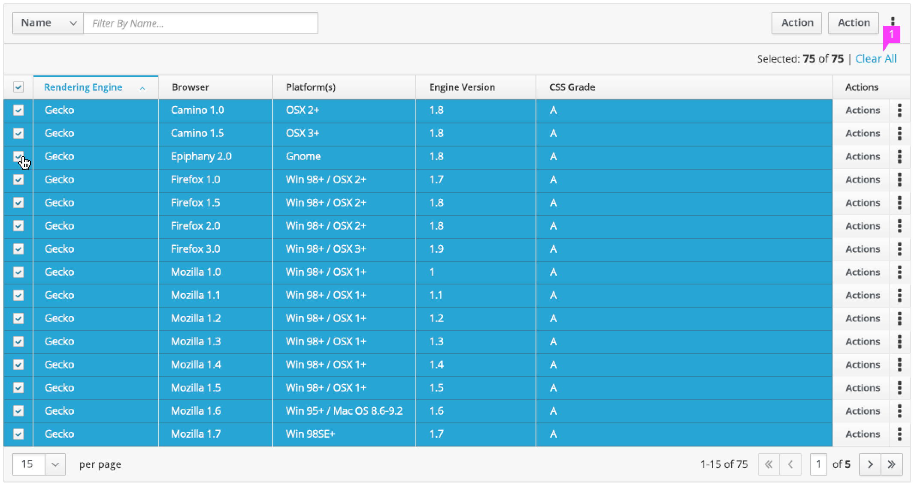

# Pagination

## footer call outs

1. **Sinsdfsdfect:**  Ysdfsdfw.
2. **Selesdfsdffo:**  Selectsdfsdfble.

## Pagination - Select All

1. **Single/Multi Select:**  You can still select all items within a single page by selecting the checkbox in the column headers. Select single items by checking the box on the left of each item row.
2. **Selection Info:**  Selection info is located in the top right and is persistent, whether there are none or all items are selected.  User always has the ability to select all items within table.
3. **Footer** (optional):  The footer has pagination elements and controls.
  * Option to modify number of items to show per page. It's recommended that the default number be less than 25 require minimal scrolling and to remain easy to consume.
  * **Item Number:**  This area shows the number of items on the page out of the total number of item in the entire table.
  * **Page Selection:**  You can jump to a specific page or jump to the first, previous, next or last page of the table.

## Pagination - Clear All

1. When any or all items are selected, user can clear selection.

## rando

