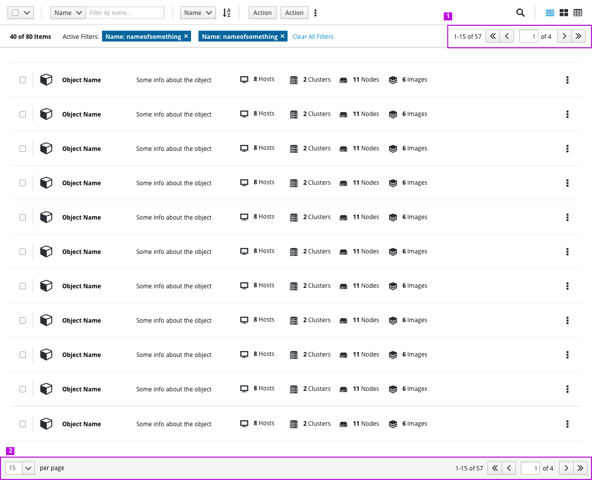
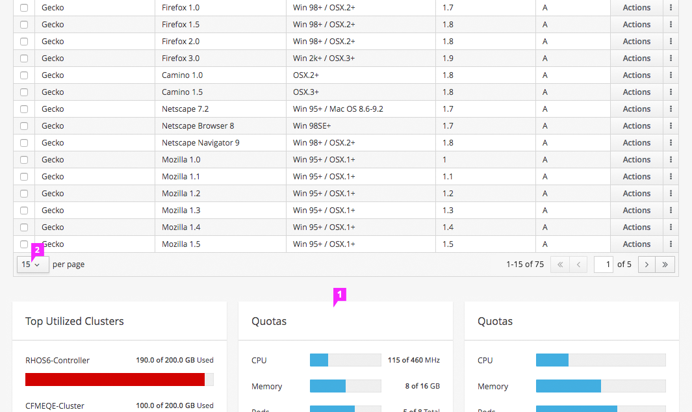
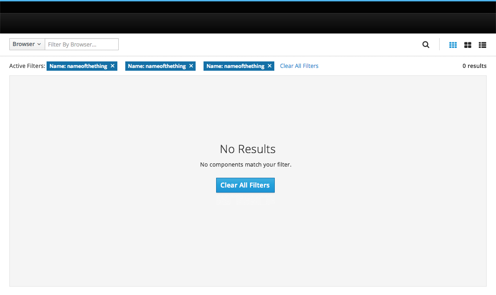

# Pagination

Pagination should be located above and below the relevant content view whenever pagination is supported.

1. **Upper Pagination Control:** A pagination control is included in the toolbar above the list.
2. **Pagniation Footer:** The pagination footer contains Items per Page and Pagination controls and is appended to the bottom of the view.

## Pagination Footer

1. **Items per Page:** This control displays the number of items on a page.
  * It includes an option to modify the number of items displayed. It is recommended that the default number be less than 25 in order to minimize scrolling.
2. **Items Displayed:** This count displays the items currently in view.
3. **Navigate Pages:** These controls allow the user to navigate to the previous or first page.
  * These controls are disabled when the user is on the first page.
4. **Current Page:** This control displays the current page and allows users to navigate to a specific page.
5. **Total Pages:** This count displays the total number of pages.
6. **Navigate Pages:** These controls allow the user to navigate to the next or last page.
  * These controls are disabled when the user is on the last page.

## Pagination - Content Below

1. **Content Below:** A sticky footer is not recommended for views with content *below* pagination.
2. **Items per Page:** It is recommended that the default number of items displayed be less than 25 in order to minimize scrolling.
  * Allowing users to change the default number should be optional.

## Pagination - No Data

* **No Data:** Pagination is not displayed when there is no data to page.

## Selection While Paging
 Items remain selected even as a user pages.
