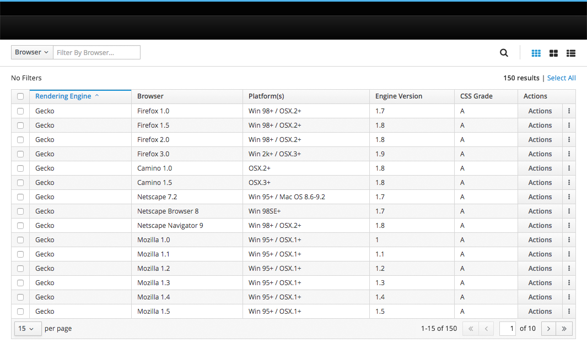
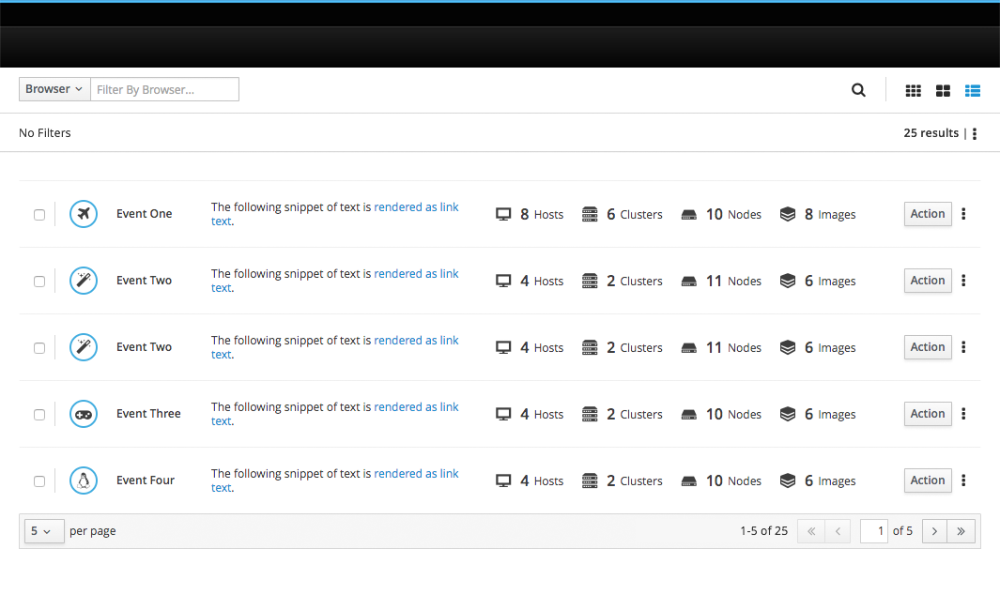
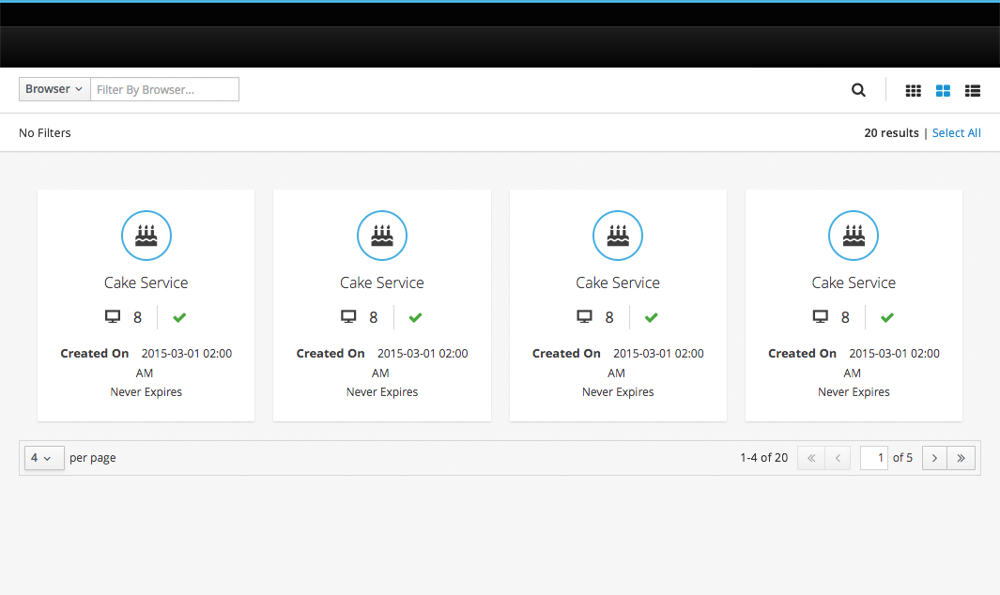

# Pagination

This pattern defines how pagination behaves within content views. When present, pagination is consistent across all three content views.

* Pagination is optional.
  * Pagination is not necessary when there is a small amount of content.
  * Pagination is not necessary when an application uses "lazy load" to load content as a user scrolls.
  * Pagination is not displayed when there is no data to display.
* When included, the pagination control should be be present both above and below the relevant content view so users may navigate between pages without needing to scroll.
* Pagination can be "sticky" and remain fixed to the bottom of a user's browser.
  * A sticky footer is not recommended for views with content *below* pagination.

## Pagination - Table View

## Pagination - List View

## Pagination - Card View

