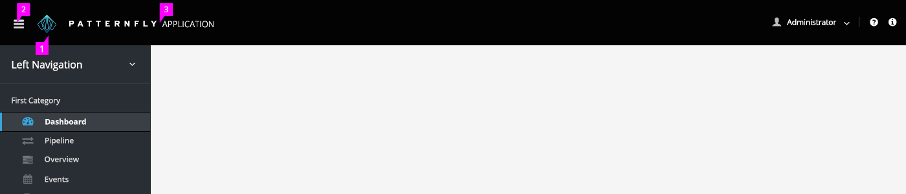
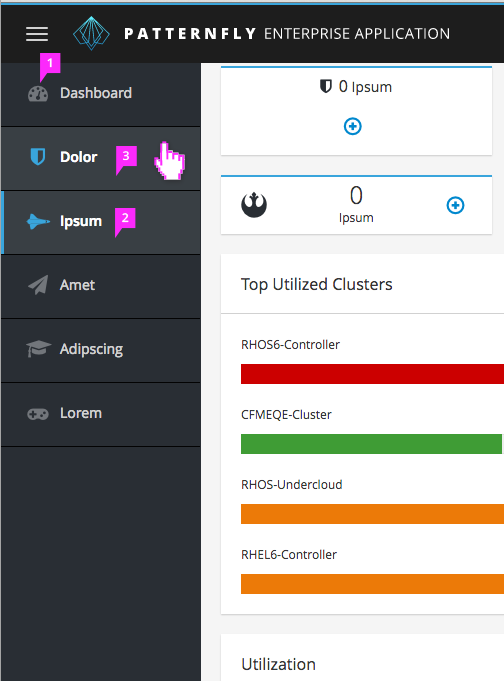
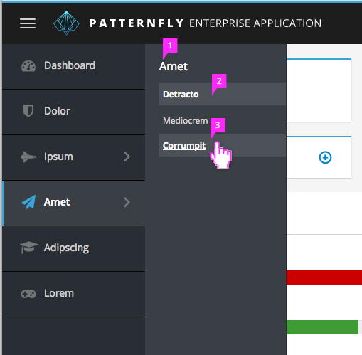
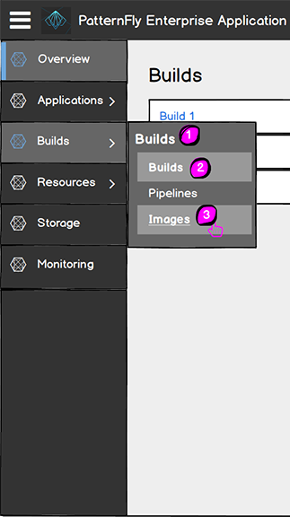
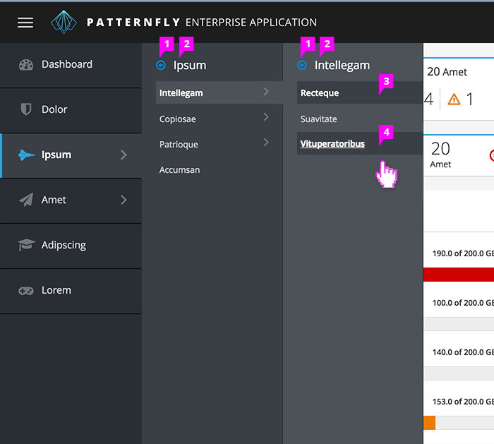
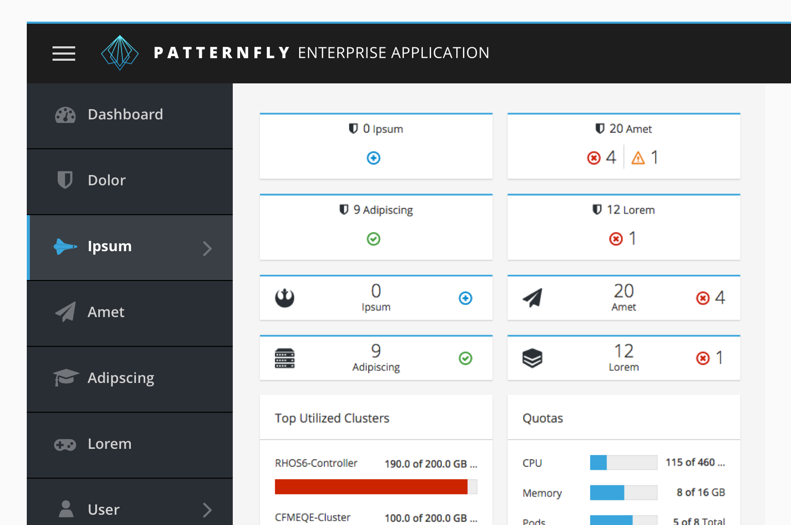
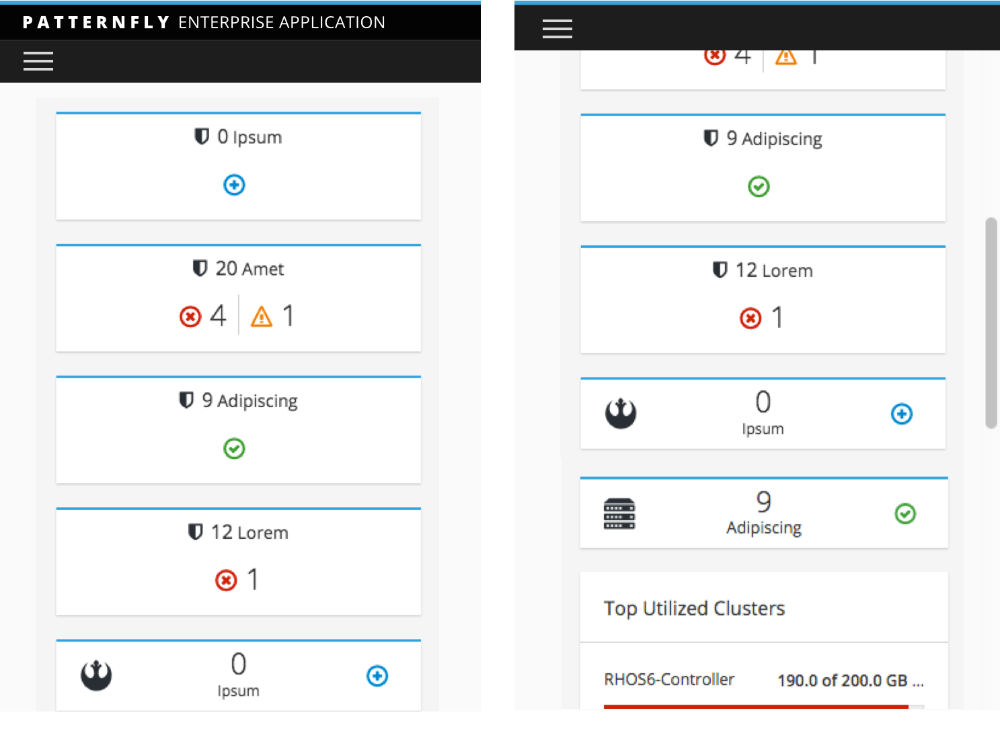
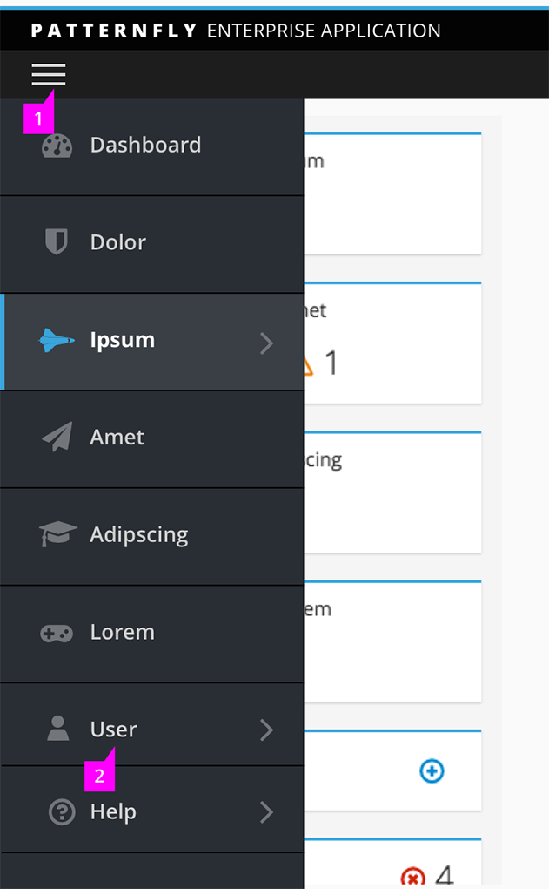
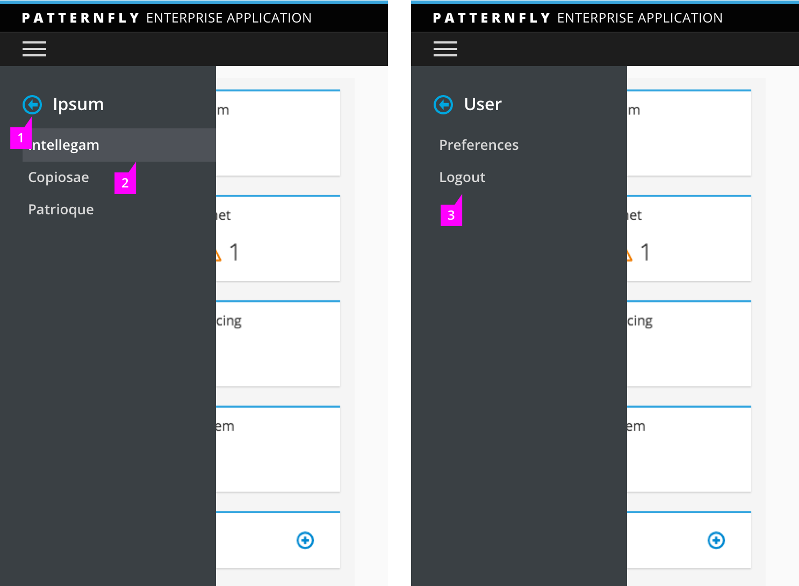
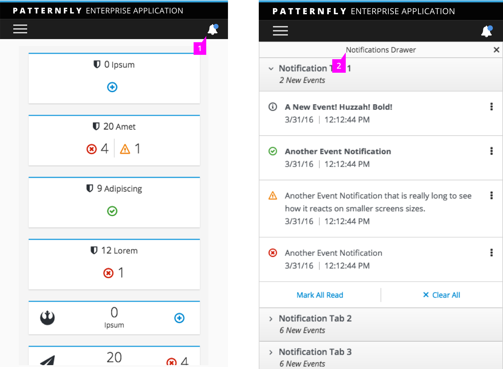

Jump to [Masthead Design](#masthead-design), [Primary Navigation](#primary-navigation), [Primary with Secondary Navigation](#primary-with-secondary-navigation), [Primary with Fly Out Secondary Navigation](#primary-with-fly-out-secondary-navigation), [Primary with Tertiary Navigation](#primary-with-tertiary-navigation), or [Responsive States](#responsive-states)

## Masthead Design

There are two options for the [Masthead](https://www.patternfly.org/pattern-library/application-framework/masthead/#_) design, one short option to save space and one tall option to accommodate for larger product logos. The tall masthead option is recommended when using vertical navigation.

1. **Branding**: Product icon can also be used in addition to the burger bar OR as a standalone icon.
2. **Burger Bar**: If necessary, the burger bar icon can be used within the masthead. The burger bar acts as a toggle to display or hide the vertical navigation text labels.
  - By default, the vertical navigation displays both icons and text labels.
  - When the burger bar is selected, the navigation text labels disappear, and only the icons are displayed. The vertical navigation is then horizontally condensed, and more screen real estate is given to the main screen content.
3. **Logo Area**: The logo area contains the application product name image file, in the form of a sized SVG graphic.
4. **Utility Items**:
  - The utility items are vertically centered and right-aligned within the masthead when there is enough horizontal room to contain them.
  - If there is not enough space for them to appear within the masthead, please refer to [Primary Navigation | Responsive State](#primary-navigation-|-responsive-state) for new utility items location.

## Primary Navigation

1. **Primary Navigation Icons**(optional): When the primary areas of the UI are easily represented by icons, they may be used in the primary navigation.
2. **Selection**: A selected primary navigation item is highlighted and includes a vertical blue line decorator.
3. **Hover**: On hover, the primary navigation item is highlighted.

## Primary with Secondary Navigation
Secondary navigation is non-persistent, appearing on hover. The secondary navigation is shown in a second column that appears to the right. (See [Secondary Navigation | Responsive State](#secondary-navigation-|-responsive-state) for how the secondary navigation is displayed on small screens.)

1. **Label**: The label at the top of the secondary menu mirrors the selected primary category to reinforce the user’s current location.
2. **Selection**: A selected item in the secondary navigation is highlighted.
3. **Hover**: On hover, the secondary navigation is highlighted and underlined.

## Primary with Fly Out Secondary Navigation
Fly out secondary navigation acts the same as the [Primary with Secondary Navigation](#primary-with-secondary-navigation), but provides an option for when a whole column is not needed for the navigation items. This is ideal for a smaller set of secondary navigation throughout the entire application. This should not be mixed with the base [Primary with Secondary Navigation](#primary-with-secondary-navigation). The fly out secondary navigation is shown in a fly out that appears to the right. (See [Secondary Navigation | Responsive State](#secondary-navigation-|-responsive-state) for how the secondary navigation is displayed on small screens. NOTE: This is the same for if you are using the [Primary with Secondary Navigation](#primary-with-secondary-navigation).)

1. **Selection**: A selected item in the secondary navigation is highlighted.
2. **Hover**: On hover, the secondary navigation is highlighted and underlined.

## Primary with Tertiary Navigation
Tertiary navigation is non-persistent and only appears on hover. The tertiary navigation is shown as a third column that opens to the right.

1. **Pin Menu**(optional):
  - If the secondary navigation is pinned, the navigation is collapsed to a single column and the secondary navigation is the only menu visible.
  - If the tertiary navigation is pinned, the navigation is collapsed to a single column and the tertiary navigation is the only menu visible.
2. **Label**:
  - The label at the top of the secondary navigation mirrors the selected primary category to reinforce the user’s current location.
  - The label at the top of the tertiary navigation mirrors the selected secondary category to reinforce the user’s current location.
3. **Selection**: A selected item in the tertiary navigation is highlighted.
4. **Hover**: On hover, the tertiary navigation is highlighted and underlined.

## Responsive States

- **Small Screen** (From 768 to 1200px): In all cases, the secondary navigation, if one exists, will replace the primary menu in a one column layout (same interactions as full-width without icons).

- **Mobile** (less than 768 px): The masthead utility items and navbar will be hidden under “hamburger” icon. The logotype and the “hamburger” icon will stack into two line. The Product logo will be hidden only remain the product name. The product name will collapse on scroll.

### Primary Navigation | Responsive State

1. **Menu Drawer**: When open, the menu appears as a drawer sliding out from the left edge of the viewport. This will overlay content area.
2. **Utility Items**:
  - Once the utility items do not fit in the masthead (on mobile devices), they will responsively move to rest underneath the menu drawer in the vertical navigation.
  - In any instance that there is an icon present in desktop state with no text label (for example, the help icon), a text label will appear next to that icon in this responsive state.

### Secondary Navigation | Responsive State

1. **Back Link**: Clicking the back link restores the primary-level menu.
2. **Item Selected**: When enter the secondary navigation, the first item will be highlighted by default in responsive state.
3. **Secondary Menu for Utility Item**: The secondary menu will not be highlighted by default in responsive state. User could chose to click either of the item.

### Vertical Navigation with Notification Drawer | Responsive State

1. **Bell Icon**: The icon of notification drawer is exposed on the second line of the masthead in the responsive state.
2. **Notification Drawer**: When clicking the Icon, the notification drawer will slide out from the right edge and the drawer will take over the whole screen width. Click “X” button on the right edge to close the notification drawer.
