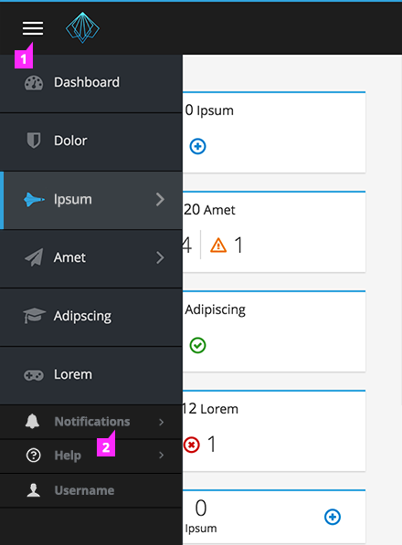
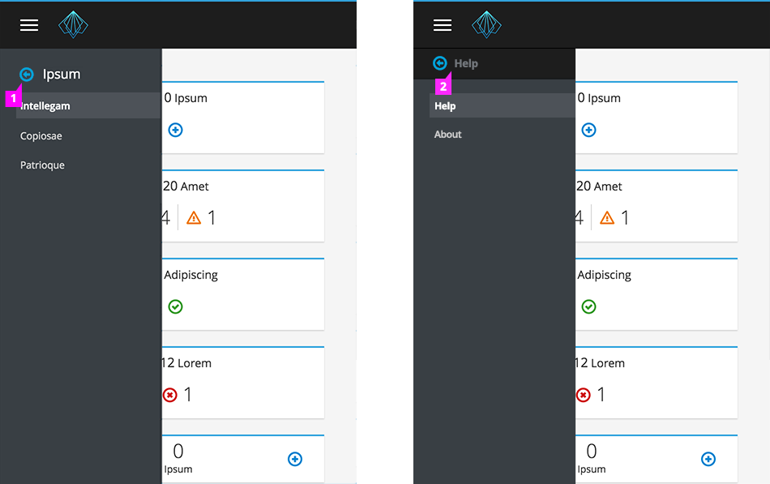
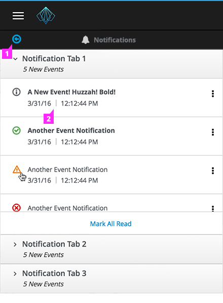

Jump to [Masthead Design](#masthead-design), [Primary Navigation](#primary-navigation), [Primary with Secondary Navigation](#primary-with-secondary-navigation), [Primary with Tertiary Navigation](#primary-with-tertiary-navigation), or [Responsive States](#responsive-states)

## Masthead Design

1. **Branding**: Product icon can also be used in addition to the burger bar OR as a standalone icon.
2. **Burger Bar**: If necessary, burger bar icon can be used within the masthead.
3. **Logo Area**: The logo area contains the application product name image file, in the form of a sized SVG graphic.

## Primary Navigation

1. **Primary Navigation Icons**(optional): When the primary areas of the UI are easily represented by icons, they maybe used in the primary navigation.
2. **Selection**: A selected primary navigation item is highlighted and includes a vertical blue line decorator.
3. **Hover**: On hover, the primary navigation item is highlighted.

## Primary with Secondary Navigation
Secondary navigation is non-persistent, appearing on hover. The secondary navigation is shown in a second column that opens to the right.

1. **Label**: The label at the top of the secondary menu mirrors the selected primary category to reinforce the user’s current location.
2. **Selection**: A selected item in the secondary navigation is highlighted.
3. **Hover**: On hover, the secondary navigation is highlighted and underlined.

## Primary with Tertiary Navigation
Tertiary navigation is non-persistent and only appears on hover. The tertiary navigation is shown as a third column that opens to the right.

1. **Pin Menu**(optional):
  - If the secondary navigation is pinned, the navigation is collapsed to a single column and the secondary navigation is the only menu visible.
  - If the tertiary navigation is pinned, the navigation is collapsed to a single column and the tertiary navigation is the only menu visible.
2. **Label**:
  - The label at the top of the secondary navigation mirrors the selected primary category to reinforce the user’s current location.
  - The label at the top of the tertiary navigation mirrors the selected secondary category to reinforce the user’s current location.
3. **Selection**: A selected item in the tertiary navigation is highlighted.
4. **Hover**: On hover, the tertiary navigation is highlighted and underlined.

## Responsive States
- **Small Screen** (From 768 to 1200px): In all cases, the secondary navigation, if one exists, will replace the primary menu in a one column layout (same interactions as full-width without icons).
- **Mobile** (less than 768 px): Navigation is hidden under “hamburger” icon.

### Primary Navigation (Responsive State)

1. **Menu Drawer**: When open, the menu appears as a drawer sliding out from the left edge of the viewport. This will overlay content area.
2. **Utility Items**: Once the utility items do not fit in the masthead (on small screens), they will responsively move to rest underneath the main navigation items in the vertical navigation.

### Secondary Navigation (Responsive State)

1. **Back Link**: Clicking the back link restores the primary-level menu.
2. **Back Link** (for Utility Item): The back link for a utility item is formatted differently from the back links for main navigational items.

### Notification Drawer (Responsive State)
Once a user selects "Notifications" within a small screen's vertical navigation menu, the notification drawer appears in full-width, with a Back Link, above.

1. **Back Link**: Clicking the back link restores the primary-level menu.
2. **Notification Drawer**: The notification drawer takes the entire screen's width when on small screens. ([See Here](http://www.patternfly.org/pattern-library/communication/notification-drawer/#/_design) for details about the notification drawer.)
