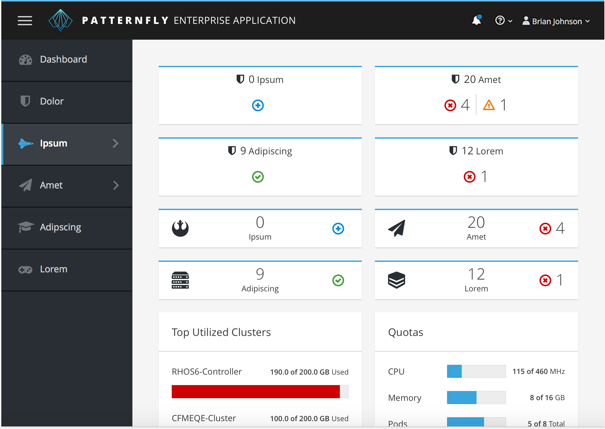
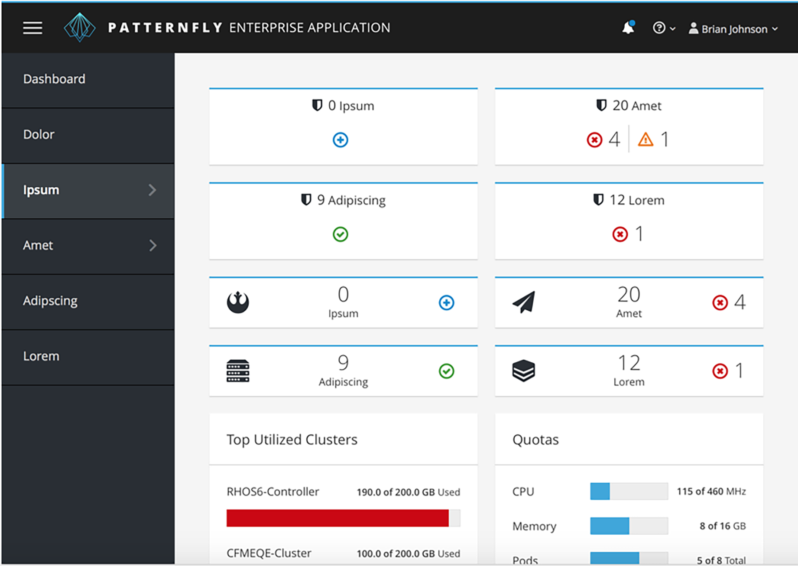

It is recommended to use vertical navigation when your application requires global navigation that is displayed on the left. While vertical navigation menus generally consume more space than their horizontal counterparts, they have become more popular as desktop monitors move to wide-screen formats. Vertical navigations have several advantages:

- They are scalable. The number of menu items is not constrained by the viewport width.
- Vertical menus more readily adapt to small screen sizes. While horizontal menus can also be made responsive, it usually requires a transformation from horizontal to vertical. Since vertical menus are already in this format, the transition from desktop to mobile is less disorienting.
- Vertical navigation supports common left to right flow. Navigation categories are easily differentiated from other information that may exist in the header area of the application.

The vertical navigation pattern supports up to three levels of navigation (Primary, Secondary and Tertiary). Each navigation item does not have to have the same number of levels of navigation. To illustrate this, look at the example below:

- The "Dashboard" category has no secondary navigation items
- The "Ipsum" category has secondary level navigation items
- The "Amet" category may have some secondary items which have tertiary navigation items

Jump to [Masthead Design](#masthead-design), [Primary Nav with Icons](#with-primary-menu-icons), or [Primary Nav Without Icons](#without-primary-menu-icons)

## Masthead Design
Since vertical navigation does not compromise vertical real estate, the masthead is taller than the masthead for products that use horizontal navigation. The taller design allows for a product icon and the option of utilizing a burger bar menu.

## With Primary Menu Icons

[View full page example](http://www.patternfly.org/pattern-library/navigation/vertical-navigation/vertical-navigation.html#_)

## Without Primary Menu Icons

[View full page example](http://www.patternfly.org/pattern-library/navigation/vertical-navigation/vertical-navigation-without-icons.html#_)
