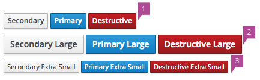

## Styling

  - Button language should be clear without the use of an icon.
  - Using an icon in a button should be reserved for specific use cases.
  - Buttons should be of equal height. Varying button height can be distracting to the user and give inadvertent importance of one button over another. Do not combine differing sizes within the same row.
  - Three sizes of buttons are offered.
    1. Default.
    1. Large.
    1. Extra Small.

## Color

  - There are four different button colors with specific meanings:
    1. Primary button blue: Use for primary call to action on page/modal. Each page should have one clear call to action, so there should never be more than one primary button used on a single page. There is an accessibility reason being that on enter the primary button should be enacted. It's possible that there could be no primary action button on a page.
    1. Secondary button gray: This will be the majority of the buttons used in an application. Any button that exists on a page that isn't a primary call to action should use this color.
    1. Destructive button red: This color should be reserved for highly destructive actions only. Most simple "Delete" or "Cancel" functions are not highly destructive. Evaluation should be done to agree that a button meets the highly destructive criteria. One examples of a highly destructive action would be allowing the user to delete all hosts that a system is dependent on to run.
    1. Disabled button : A button that could become enabled, but is currently not available should use this state.

