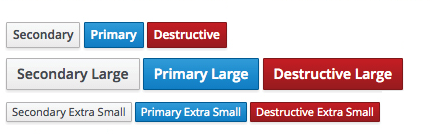

Buttons communicate an action that the user can take when they interact with them. There are a number of types of buttons than can be used and depending on the use case, it is recommended to make use of the following examples.

## Usage Examples

  1. **Close Button:**
    - If closing a modal, follow the [Modal Widget](https://www.patternfly.org/pattern-library/widgets/#modal) guidelines.
    - If referring to closing another type of view use "Close" as a secondary button.
  1. **Delete Button:**
   - "Delete" should be used in a secondary button unless you have a limited use case where the Delete action is a highly destructive action. In that case, use the destructive button. Ideally, a delete button would be followed up with a confirmation modal for the user to confirm this action.
  1. **Cancel Button:**
   - "Cancel" should be used in a secondary button unless you have a limited use case where the Cancel action is a highly destructive action. In that case, use the destructive button.
  1. **Buttons within the Toolbar (Above List View, Table View, Card View):**
   - Refer to the [Toolbar Pattern](https://www.patternfly.org/pattern-library/forms-and-controls/toolbar/#_) and the guidelines above when formatting buttons in a toolbar above a content view.
  1. **Buttons within a Modal:**
   - Refer to the [Modal Widget](https://www.patternfly.org/pattern-library/widgets/#modal) and the guidelines above when formatting buttons in a modal.
  1. **Buttons within a Wizard:**
   - Refer to the [Wizard Pattern](https://www.patternfly.org/pattern-library/communication/wizard/#/_design) and the guidelines above when formatting buttons in a wizard.
  1. **Buttons within a Form:**
   - Refer to the [Form Pattern](https://www.patternfly.org/pattern-library/forms-and-controls/forms/#_) and the guidelines above when formatting buttons in a form.

