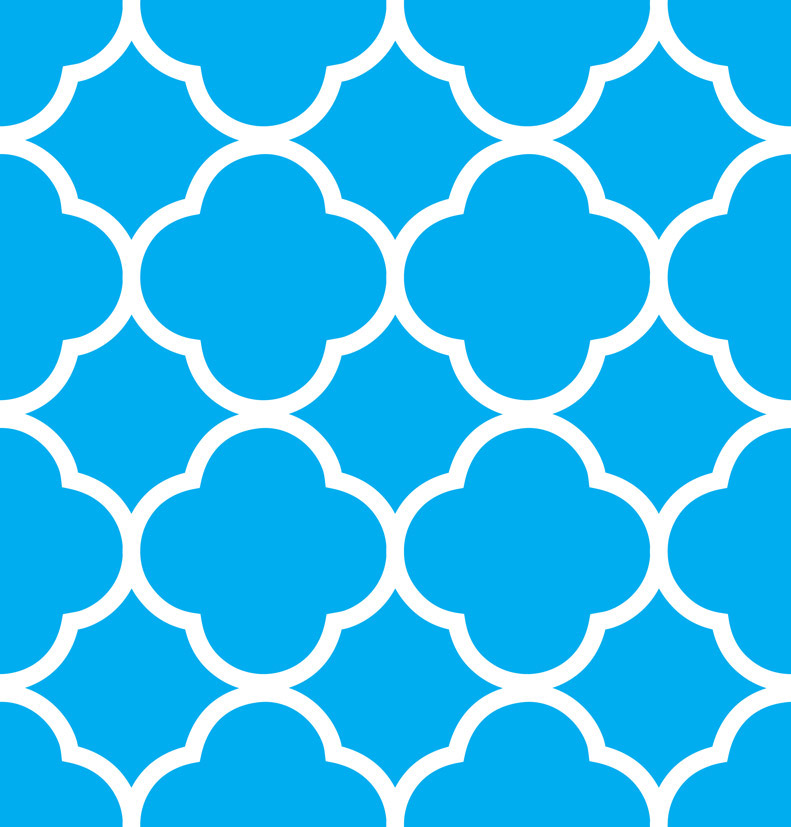

This template should provide high level information on the design, to inform the user, at a glance, if this pattern is a fit for their needs.

# Enter Pattern Name Here

## Overview

(Remove instructional text)  
Provide one or two sentences, describing the pattern you are contributing.

Example: (remove all example text and text in parentheses)
* "This pattern" can be used to present large amounts of data, providing flexibility and power to manipulate the data in a meaningful and understandable way.

## Use Cases

(Remove instructional text)  
Use cases describe how the user will perform a task, from the users perspective, outlining behaviors and simple steps to achieve the users goal.

This information should help the user understand when and why this pattern should be used and when not to use.

## Pattern Example Name Here

## Pattern Variation Example Name Here

