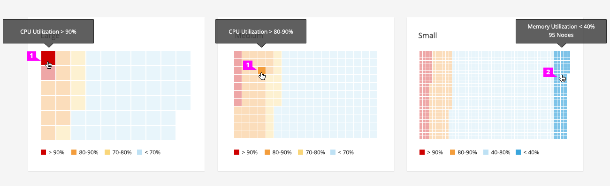

#Heat Map

##Standard Heat Map

1. **Block:**
  * Each block is a square that represents an object in the a data set.  
  * All blocks should be the same size. The size of blocks are based on the number of blocks in the heat map.
  * Blocks are ordered by the attribute status. The object whose attribute is at the highest percentage will be placed in the top-left corner of the map. The remaining object blocks are presented in a descending order (from top-bottom, left-right) by order of percentage.
  * The user should be able to click on a block in the heat map to get more detailed information about the object.  Design alternatives will be added in a future version of this pattern.

2. **Block Fill:** (optional)**:** Choose a fill color that best reflects the attribute being represented.
  * Colors should be based on the PatternFly [color palette](https://www.patternfly.org/styles/color-palette/)
  * Colors ranges should be relevant to a particular attribute. 			
  * Status thresholds can be represented by the following colors:			
  * Critical range: Red (#CC0000)		
  * Warning range: Orange (#EC7A08)		
  * Trending to Warning: Yellow (#F9D67A)			
  * No Issues: Light Primary Blue (#BEE1F4)

3. **Tooltip:** Tooltips should include the name of the object as well as a summary of the data represented, for example utilization or object status.

4. **Legend:** It is recommended to include a legend to define the colors on the chart. Multiple heat maps may reference a single legend, provided they share the same attribute values. The legend may be located left aligned and underneath the chart or left aligned and to the right of the chart.
  * **Interactive Legend** (optional): Clicking on a series in the legend should toggle the visibility of the series in the chart. Hovering over a series in the legend will highlight the blocks associated with that attribute.

##Hover Behavior
There are two variations of hover dependent on the block size. These variations include a hover state for a single block and a hover state for a collection of blocks.

1. If the block size is at least 16 x 16px, hovering over a block will dim ALL blocks other than that single block. The tooltip is specific to the object represented by that block. Recommended maximum block size is 50 x 50px

2. If the block size is smaller than 16x16, hovering over a block will dim all blocks NOT associated with that specific RANGE. The tooltip is specific to the range itself. Recommended minimum block size is 2x2.
