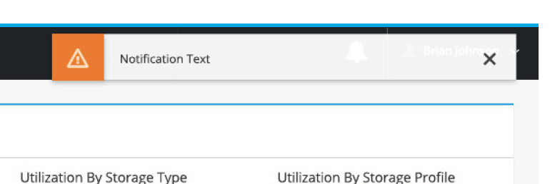

#Notification Drawer

##Toast Notification

1. **Toast Notification:** The drawer should utilize the current [Toast Notification](https://www.patternfly.org/pattern-library/communication/toast-notifications/#/api). The notification shows the title and an optional content-relevant icon.

##Notification Drawer

1. **Icon:** Displays visual differentiator when new or unread notifications are present. Clicking on the icon will slide out a drawer and dismiss the toast notification. Clicking on the icon again will close the drawer.
2. **Drawer Title:** Title of Drawer.
3. **Accordion:** Only one notification tab may be opened at a given time -maximizing drawer space. Italicized text will indicate number of new events. Clicking on the title will expand accordion.
4. **Row:** Example content shows relevant icon creating a visual differentiator between content severity or object type. New/unread notifications are shown in bold.
5. **Row Hover State:** Example of hover state.
6. **Mark All Read:** Clicking “Mark All Read” changes all visible unread rows (bold row type) to read (regular row type).
7. **Icon Empty:** The empty state shows no new events.
8. **Row Actions:** Clicking on the [Kabob](https://www.patternfly.org/pattern-library/widgets/#kebabs) menu will reveal a drop down containing actions for that item.
9. **Infinite Scroll:** Infinite scroll reduces need to identify time range on accordion tab. Allows for free-range historical search of notifications.

##Expand Behavior (optional)
The notification drawer has the ability to expand in order to view additional details regarding an event. The expand drawer functionality is optional. Use of this feature will depend on the amount of information available.

1. **Collapsed Drawer:** The expand icon is in the top left corner of the notification drawer and is shown as a link to expand the drawer.
2. **Expanded Drawer:** Individual rows may include additional information when in the expanded state. The collapse icon is in the top left corner of the notification drawer and is shown as a link. All other notification drawer features should remain the same as the collapsed view.

###Collapsed Drawer

###Expanded Drawer

