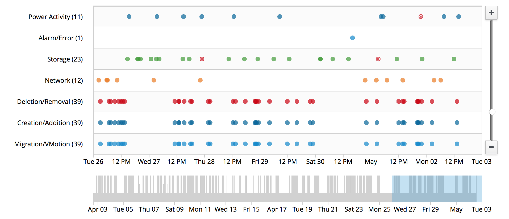

# Timeline

## Overview

A timeline is a visualization of events over time.  Event types are shown as individual rows on the timeline.  Each occurrence of an event is displayed on the associated row by a shape/icon and color.

The most common use case for a timeline is to show a timeline of events associated with a specific object.

## Examples

### Timeline

