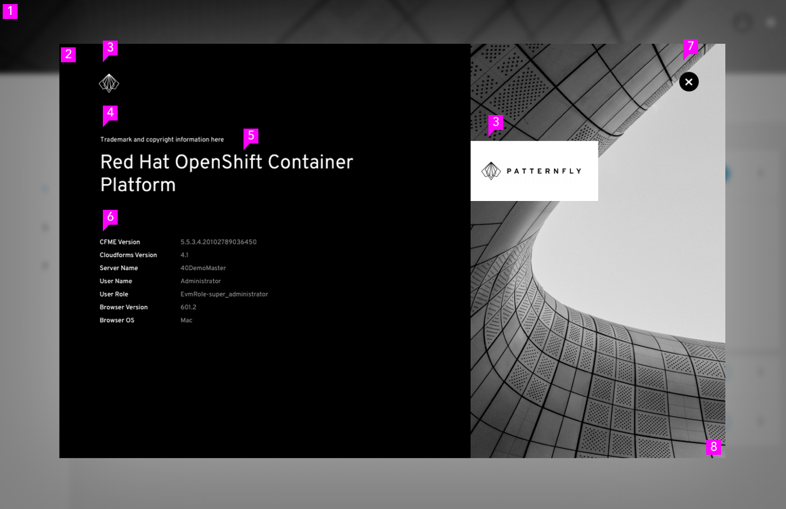
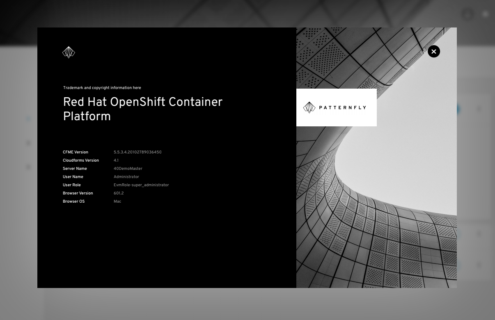
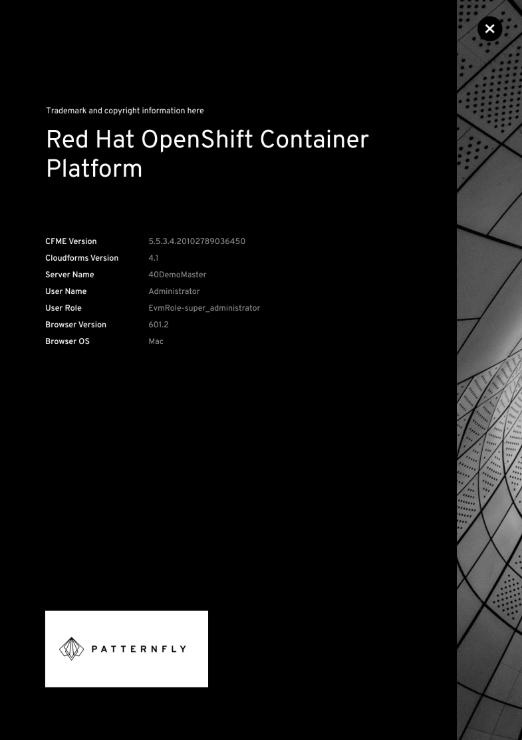
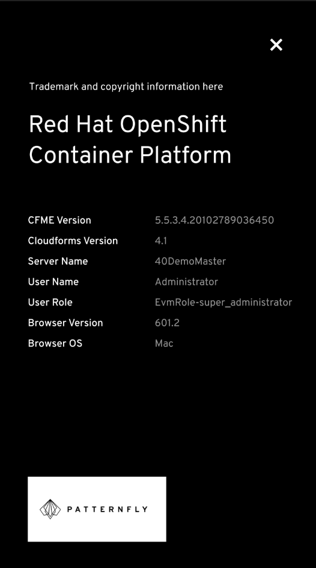

# About Modal
The About Modal stores the version number(s) of the application as well as any appropriate legal text.

## Elements of an About Modal

1. Backdrop
2. Modal box
3. Branding box: Use this area to provide logo and branding for the product
4. Trademark and copyright information: Optionally include legal text. Suggested format for copyright -  Copyright (c) 2018 Company
5. Product title
6. Content: Label and version.
  * When version and build information are both shown: Version 6.3 (Build 5)
  * When version only: Version 6.3
  * When build only: Build 5
7. Close
8. Background image

## Usage
Use the About Modal to provide information about the product including the product name, logo, version numbers, and any appropriate legal text.

## Variations
##### About Modal - Default view

##### About Modal - Responsive view (Tablet)

##### About Modal - Responsive view (Mobile)

