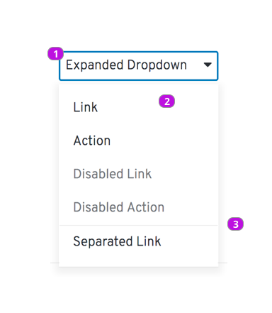
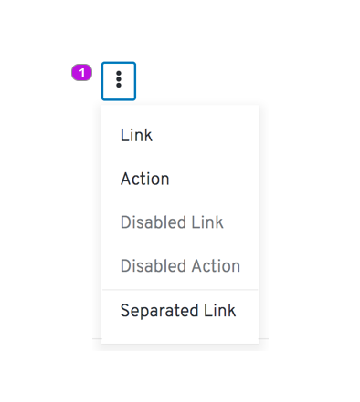

# Dropdown

## Elements of a Dropdown

1. **Button** The button is a clickable element that allows the user to open and close the dropdown menu. The button label describes the content of the dropdown. For example, "Actions" can be used if the menu will include a list of actions.
2. **Menu** The dropdown menu lists available options or actions.
3. **Separator (optional)** Separators can be used to group actions.

### Dropdown as a kebob menu

1. **Kebab** The dropdown button can be replaced by a vertical ellipses (kebab) icon to further reduce the footprint of the menu.

## Usage
Dropdown menus allow you to expose multiple options or actions on a page without allocating space for all options to be visible at all times.
### When to use
Use a dropdown menu when you want to expose a set of actions or navigational options and there are either too many of them or not enough space to include all of them on the page as links or buttons.

In situations where space is very constrained, consider using the kebab variation.

### When not to use
Using a dropdown menu trades space saving for visibility of options. Therefore, use of buttons or links is always preferred when there is enough space to do so.

Dropdown menus should not be used for selection of options within a form. In those cases a select list should be used.

### Best practices
* Three to seven items is optimal for dropdown menus. If you require more than seven items, separators and recommended to group menu items.

* Disable menu items (actions) that are temporarily unavailable, are not applicable, or the user doers not have permission to execute.

* Order items by expected usage with most frequently used actions at the top.

## Content
The label associated with the button element should be descriptive on the contents of the dropdown. For lists of actions, "Actions" should be the default choice.

Menu items that name actions should be verb based and easily scannable. In most cases, action labels should be limited to one or two words, where the first word is the action and the second word is the object it will be performed on, e.g. "Delete File".

## Related components
* Select list
