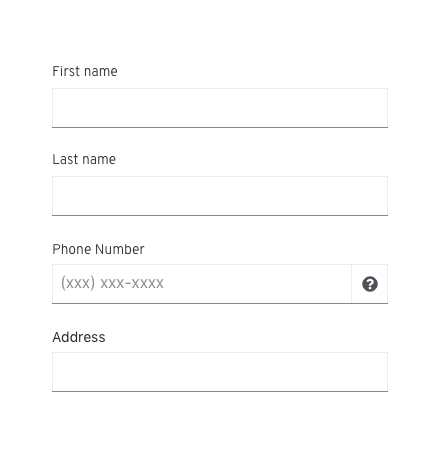

# Forms
## About
A form is a group of elements used to collect information from a user. Forms can be presented to the user in a variety of contexts depending on the use case and scenario.

## Elements of a form
While every form will require a different combination of components depending on the use-case, most forms will contain the following basic elements:

1. [Labels](../data_input) - Field labels can be aligned to the left or top of the field depending on the layout of your page and the amount of space you have to work with. Indicate all required text and input fields with a red asterisk. Learn more about field labels in the [text and data input design guidelines](../data_input).

    *Required field*
    

  *Vertical alignment*
  

  *Left alignment*
  

2. [Text field](../data_input) - provides an area for users to input free-form text.
3. [Data input](../data_input) - provides a way for users to submit any information that is not free-form text. Input components are designed for specific use cases.
4. [Help](#Provide-the-right-kind-of-help) - provides assistance in any area where the user might need additional information or context to provide the right input
    * Field level help - provides content in a popover.
    * Input help - provides help in or directly below a field.
        * Helper text
        * Syntax hints
5. Action buttons - enable a user to submit or exit a form.
6. [Validation and errors](#Provide-validation-and-errors) - ensure that the correct information is collected before the form can be submitted to the system.

## Components used in forms
The PatternFly components listed in the following sections can be used in a number of ways to suit specific needs or use-cases. We’ll explore several examples in this documentation.

* Text fields
* Popovers
* Buttons
* Data input
    * Radio buttons
    * Checkboxes
    * Datepicker
    * Timepicker
    * Touchspin
    * Switch
    * Select list
    * Combo box

**Related components**
* Modal
* Wizard

## Usage
### Use progressive disclosure

Use progressive disclosure to hide and show fields based on the users’ selection. This approach keeps the workflow short and allows the user focus on only the fields relevant to them. It also avoids using color to indicate whether or not a field is available, making it suitable for colorblind users.

### Choose the right data input
There are multiple components that enable a user to make a simple selection. To learn more about data input, visit the [text and data input design guidelines](../data_input).

### Provide the right kind of help
There are multiple ways to provide help on forms.

**Field level help**

Use field level help to provide additional context to a text or input field. Field level help is denoted by the information icon and displayed in a popover on a click.

:thumbsup: **DO**
 - - - - 
* Use field level help wherever any field needs additional background or explanation.
* Keep descriptions as concise as possible.

:thumbsdown: **DON'T**
 - - - - 
* Don’t use field level help to compensate for bad design or rely on it to explain a graphic or word choice.
* Never hide critical information in a popover. Don’t put any information into a popover that a user needs to complete their task.

**Helper text**

Helper text is text below a form field that helps a user provide the right information, like “Add a unique name.” Use helper text for any information that a user needs to provide the correct input. For context or background information that is “nice to have,” use field level help in a popover.

:thumbsup: **DO**
 - - - - 
* Keep helper text concise while providing enough information to enable a user to complete their task.
* Limit the use of helper text to avoid overwhelming the user.

:thumbsdown: **DON'T**
 - - - - 
* Try to avoid helper text that exceeds the length of the input area.
* **Never** use helper text as a replacement for form field labels.

**Syntax hints**

A syntax hint provides an example of the required or recommended format for data input. Use syntax hints when the requested data type might be unfamiliar, or the field requires the user to provide data in a specific format.

:thumbsup: **DO**
 - - - - 
* Only use syntax hints for text input fields.
* Keep hints concise; never extend the length of the text field.
* Limit the use of syntax hints to avoid overwhelming the user.

:thumbsdown: **DON'T**
 - - - - 
* Don’t use syntax hints for complex and lengthy requirements like password requirements. Instead, use field level help.
* Don’t provide syntax hints when they are not necessary.
* **Never** use syntax hints as a replacement for form field labels.

### Provide validation and errors
Let users know whenever a form field submission results in an error. Always present error states on the form, and use inline errors whenever possible. The error state you use will depend on whether the validation happens on the client or the server.

**Client-side validation**
Client-side validation can be performed as soon as a field loses focus, and allows you to use inline validation to alert users of errors or issues immediately. This type of validation allows users to quickly see and address issues, but can become frustrating or overwhelming if overused.

Some common use cases include:
* A user entering data in an invalid formats
* A user leaving a required field blank
* A user leaving a required field incomplete

> Note: Inline error messages will replace helper text.

**Server-side validation**
Server-side validation is performed when the user attempts to submit a form. In this scenario, the user completes the form in its entirety and the page is reloaded with any errors detected.

For server-side validation, use an inline notification along with inline errors wherever possible to make it simple for the user to quickly identify areas that need to be fixed.

Notification messages should describe the error and help users solve the problem. Once form errors are resolved and submitted, the notification should be replaced with a confirmation message.

### Using forms in your designs
**Full page**

**In a modal**

> Note: When using forms in a modal, button placement is different. Buttons are aligned to the right edge of the input field. The primary button is on the far right and the secondary button is to the left.

**As a wizard**

> Note: For buttons on wizards, follow modal standards. Buttons are aligned to the right edge of the input field. Place the primary button on the far right and the secondary button is to the left.

### Content guidelines
Think of a form as a conversation between your application and your user. Apply the following principles to organize and craft content for your forms:

**Focus on the task and context**
Make sure you are clear about what the user is trying to accomplish with this form and how your users are thinking about the task they’re trying to complete.

* What terminology do they expect to see?  
* What kinds of questions will they have?
* Where might they get stuck?

Start by writing out the conversation you might have with someone if you were guiding them through the task. This exercise can help you organize your form, name your fields appropriately, better understand the context of the task, and write in a more natural way.

**Use your understanding of context to plan your content hierarchy:**

* **Include the most critical information in the field label.** Answer the most basic question first: what data do I need to provide here? The field label you choose will depend on the context of your form. For example, can you ask for an address, or do you need to ask for a business address? Is it enough to request a name, or do you need to specify first name, last name, and middle initial?

* **Include critical secondary information as helper text.** This is any information a user must have to provide the right input. For example, a user creating a name for a new asset may need to specify a unique name for that asset. Letting the user know this up front helps avoid unnecessary errors.

* **Include background information/context as field-level help in a popover.** Never hide critical information in a popover. For example, you could use this type of help to define an unfamiliar term or concept that a novice user might not be familiar with.

**Use natural language**
Again, think of a form as a conversation with your user. No one wants to have a conversation with a robot.
