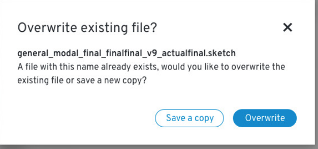
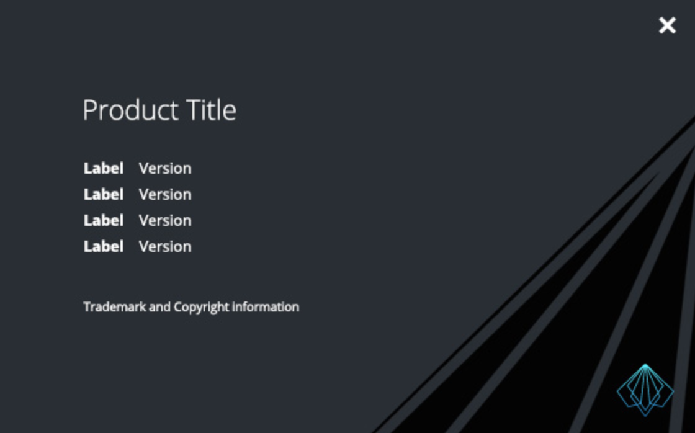
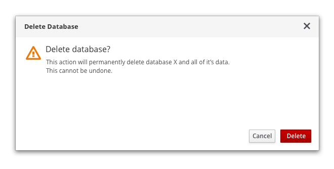
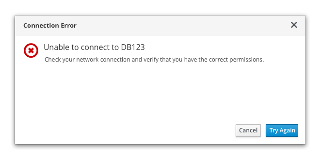
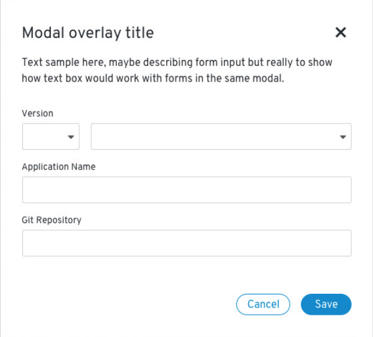
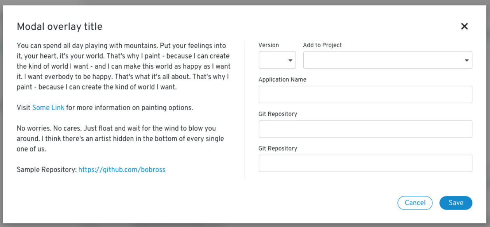
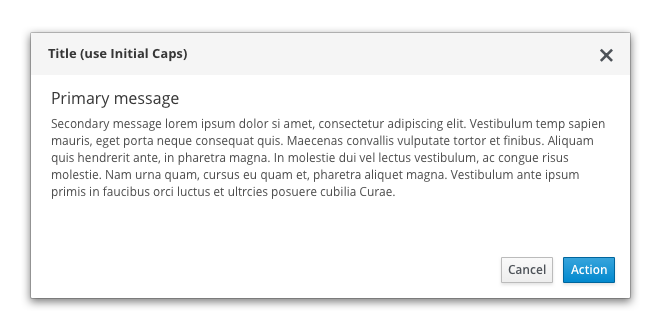

# Modal
Modals load and display important information without navigating away from the current page.

## Elements of a modal

1. **Title:** Concisely convey the purpose of the modal.
2. **Close**
3. **Content area**
4. **Buttons:** Action buttons should be right aligned. Make your primary action the right-most button.
5. **Background**

## Usage
### When to use
Use a modal when information is critical and requires user input or attention.
Use modals to:
* Validate user decisions
* Report errors
* Provide the result of a task or state of an application
* Get required user input

### When not to use
Modals interrupt user task flow and should be avoided for any information that is not critical to user success.

### Use cases
#### About Modal

The About Modal stores the version number(s) of the application as well as any appropriate legal text.

For more information about this component, see [About Modal](../about-modal).

#### Confirmation Modal

Use a confirmation modals to validate user decisions and communicate consequences.

_Confirming a destructive action:_ Use a warning icon for actions that are difficult or impossible to undo. If an action will seriously impact the system and cannot be undone, use a destructive style button. Otherwise, use a primary button.

_Note:_ Since confirmation dialogs disrupt user task flow, do not provide confirmation dialogs for actions that are easily reversed or insignificant.

###### Content Guidelines
* Clearly restate the action the user is trying to take and explicitly outline the consequences of that action.

* Provide buttons labels that make it simple for users to understand and confirm their choices. Use descriptive verbs that clearly indicate the consequence of a selection, like Delete, Save, or Create. Avoid vague labels like OK or Done.

* Use descriptive title and button labels so the user can scan  content and make a decision quickly. Ambiguous title and button labels make it more difficult for the user to understand their options and make a decision.

#### Error Modal

Use error modals to inform users of problems interrupting normal or expected behavior.

###### Content Guidelines
* Make sure errors are actionable, human readable, and answer the following questions: _What is the problem? Why did it happen? How can I fix it?_
*  Never blame the user. Use passive voice where appropriate to avoid assigning blame. For example, instead of _You put in the wrong password_, try _That password wasn't recognized._

#### Passive Modal

Use passive dialogs to communicate critical information like the status of an application or result of an action.

###### Content Guidelines
Clearly communicate the issue and any actions required of the user as a result of the issue. Information should be important, immediately relevant, and either lead to or require action on the user’s part.

#### Input Modal

Use input modals to collect required user input.

#### Combo Modal

Use combo modals when you need to provide informational text and collect user input.

## Styling
You can use a simple modal or a modal with an icon. The icon you use needs to align with the type of modal you are creating.

### Simple modal dialog

### Modal dialog with status icon

