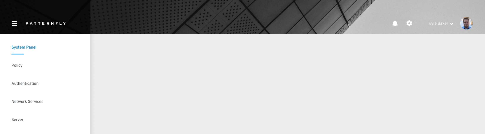
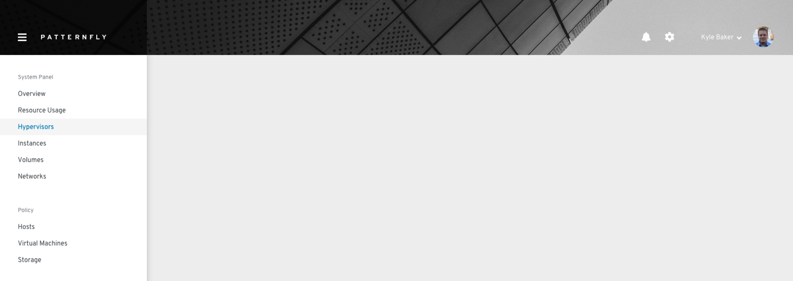
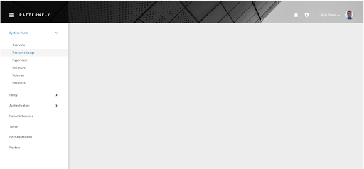
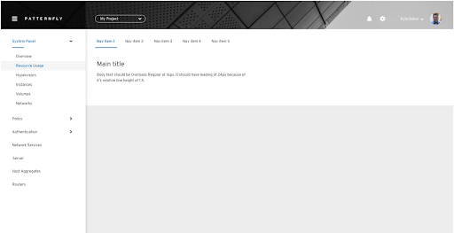

# Navigation system
Navigation is used to organize an application’s structure and content, making it easy to find information and accomplish tasks. Navigation communicates relationships, context, and actions a user can take within an application.

### Vertical navigation

Vertical navigation is hierarchical global navigation that displays nav items from top to bottom on the left side of a screen. PatternFly vertical navigation can be collapsed to provide additional screen real estate by using the icon at the top left.

#### When to use
* You have five or more primary navigation items
* You have secondary navigation items (even if you have less than five primary navigation items
* You expect your application to be used on desktop, laptop, and mobile devices

#### Variations
**Simple vertical navigation**
Use simple vertical navigation when you only have one level of navigation to display and more than five primary nav items. If you have five nav items or less, you may want to use horizontal navigation.

**With secondary navigation**

When you have a small amount of secondary nav items, you can display them persistently beneath the primary navigation items.

**Expandable**

When you have a large number of secondary navigation items, you can use an expandable navigation to collapse and expand options as needed.

### Horizontal navigation

Horizontal navigation is global navigation that displays nav items from left to right at the top of an interface.

#### When to use
* You have less than five primary navigation items
* You have only one level of navigation and no secondary navigation items

### Tertiary navigation

1. Primary navigation
2. Secondary navigation
3. Tertiary navigation

Global navigation is limited to two levels - primary and secondary. You can add tertiary navigation when you need to include local navigation specific to a particular window or tab in the interface.

### Context selector

Use a context selector in addition to your global navigation when the data or resources you need to show in the interface are dependent on the users’ context. For example, you may need to display details about different regions, projects, or organizations.

### Breadcrumbs

Breadcrumbs act as a resource to help users navigate more efficiently and provide context to help users understand where they are in the application hierarchy. Use breadcrumbs in addition to your global navigation to display a user's location in the application. 

#### When to use
* Use breadcrumbs when the primary and secondary navigation items are not always exposed.
* Don't use breadcrumbs as a replacement for global navigation.
