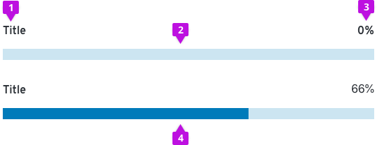
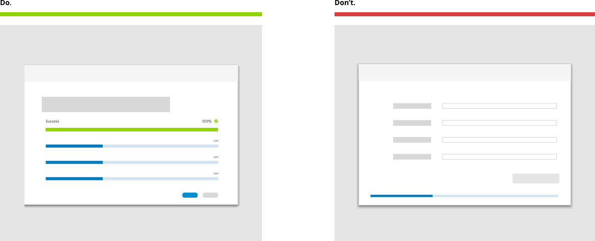
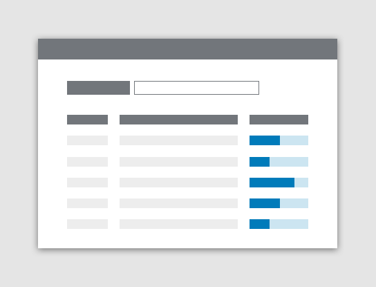
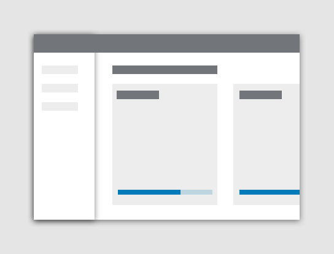
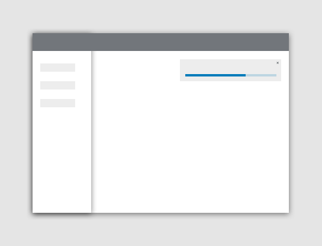
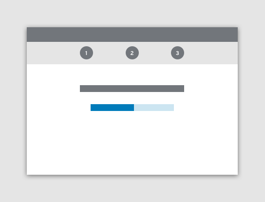

# Progress bar
Progress bars inform users about the status of ongoing processes, such as loading an app, submitting a form, or saving updates. Progress bars can also inform users about their progress through a tutorial or a series of steps to reach completion.

## Usage
Use a progress bar to visually indicate an extended operation that needs to be completed by a user or system.

Without a progress bar marking their progress towards completion a user could become lost about how much effort or time it will take to complete a given process. Progress bars solve the problem of helping users understand how much of a process has been completed.

### The anatomy of a progress bar

Progress bars are composed of four elements:

1. **Title**

  When writing the progress bar title concisely convey the task the user or system is working to complete.
2. **Track**

  Use the track as a visual guide to describe to the user what it takes to meet full task completion.

3. **Value of progress**

  Use a value of progress that is most helpful to the user for a given use case.

4. **Indicator**

  Animate the indicator along the track to draw the user eye to the progress bar and demonstrate the user’s progress towards completion.

### When to use

**Determinate progress bar**

The determinate progress bar is marked with a percentage that indicates the amount of progress that has been completed in a process.

**Determinate progress bar that displays percentage completed**

Use a percentage as a value of progress if the process will take less than a minute. If the percentage value of progress will be more accurate than the timing value, then use a percentage value such as 66%.

**Determinate progress bar that displays time remaining**

Instead of percentage use a time interval value, such as “4 minutes remaining” to demonstrate the value of progress if a process is greater than 1 minute; however, choose a percentage to mark the progress value if the percentage measure will be more accurate than listing the time.

**Indeterminate progress bar**

The indeterminate progress bar represents progress that cannot be measured, and, therefore does not contain a percentage that indicates the amount of progress. Only use an indeterminate progress bar if progress cannot be measured.

**Use cases that can be supported by progress bars**

* When the user must complete a series of tasks and will want indication that they are making process
* When the user needs indication that the system is progressing in loading, saving, and downloading
* When a process needs to be reflected to a user that is happening in the background, especially when this may take a long time

### When not to use
Do not use an indeterminate progress bar to indicate measurable progress. Users need progress bars to represent measurable progress if at all possible. Use an indeterminate progress bar only if progress is not measurable.

Do not use a progress bar when a spinner should be used instead. A spinner should not be used for long processes. Only use a spinner if a process will take 1-4 seconds. A spinner will never replace a determinate progress bar as the spinner does not provide helpful information about loading time to a user.

Do not use a spinner and a progress bar together. Use one progress measure at a time.

## How to use progress bar in context

The Do state demonstrates that the progress bar should be placed in alignment with relevant context. The Don’t state demonstrates that the progress bar should not be used without a descriptive title and a percentage of completion when possible. The progress bar should be placed within the user’s line of sight as a guide.

**How to use a progress bar in a table**

If the progress bar records the progress of multiple line items, keep the progress bar in-line with line item it pertains to.

**How to use a progress bar in a dashboard**

On the dashboard view use a progress bar to track the trends within the card components on the page.

**How to use a progress bar when a file is downloading**

When a file is downloading use the toast notification component and a progress bar to demonstrate the progress achieved.

**How to use a progress bar in a wizard**

Use a progress bar in a wizard to demonstrate to the user where they are in the flow.

## Styling
Styling for the progress bar should follow accessibility guidelines. The styling demonstrated below should guide design decisions.

A blue progress bar represents a process in progress.

A red progress bar represents a process that has failed, and the accompanying the times-circle icon demonstrates the error that has occurred in the process.

A green progress bar represents the successful completion of a process, and the accompanying the check-circle icon demonstrates the error that has occurred in the process.

## Content
Titles should clearly describe the process that is being measure. Try to keep titles between 1 and 3 words.  An example of a title could be “Downloading Your Application.” Insert in “Your Application” the application name.

Do not provide any other supporting copy to the progress bar that would require the user to read about how to use the progress bar. A progress bar should be self-explanatory if you implement labels 1 through 4 that are detailed in the article above.
