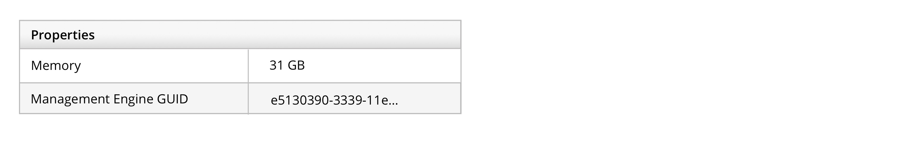
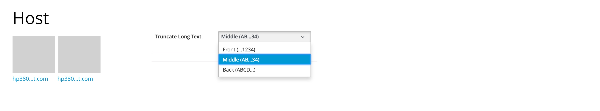
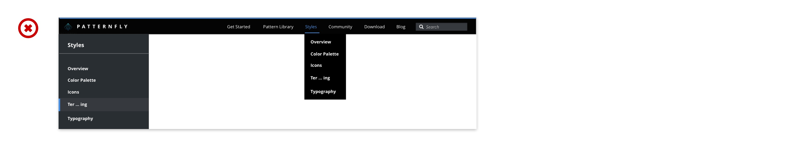
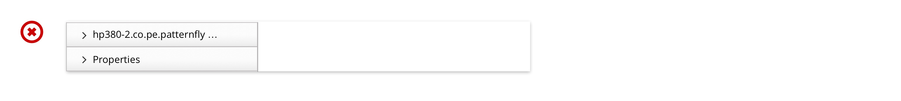
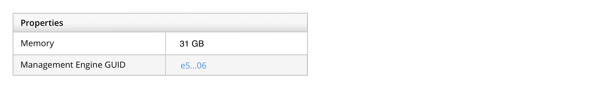
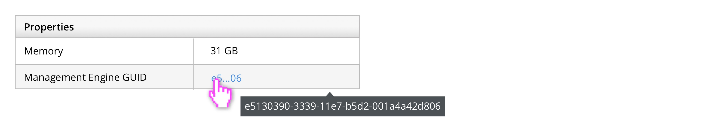
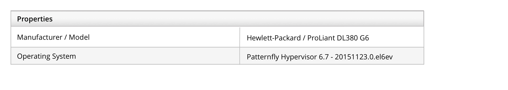
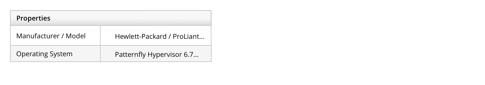

# Terminology, grammar, and mechanics

## Index

1. [Common terminology](#common-terminology)
1. [Abbreviations](#abbreviations)
1. [Acronyms](#acronyms)
1. [Capitalization](#capitalization)
1. [Links](#links)
1. [Punctuation](#punctuation)
1. [Truncation](#truncation)

## Common terminology

| Term | Usage | Opposite | Notes |
| ----- | ------ | ---------- | ----- |
| Add |  (v.) Use to describe the action of adding an existing item to an existing list, group, view, or other container element. | Remove | If the object being added is not readily apparent from the context, consider adding a noun, like _Add User_. If you are creating a new object, do not use _Add_. See _Create_. |
| Change | Do not use. See _Edit_. | | |
| Create | (v.) Use to describe the action of creating something new. | Delete | If the object being created is not readily apparent from the context, consider adding a noun to the button label, like _Create User_. _New_ or _Add_ are not recommended for this use case. See "Add" for usage guidelines. |
| Delete | (v.) Use to describe the action of completely removing an object. _Delete_ is a destructive action. | Create | _Erase_ and _Remove_ are not recommended for this use case. See _Remove_ for usage guidelines. |
| Edit | (v.) Use to describe the action of making changes to an object like a file, configuration, or policy. | | _Modify_ and _Change_ are not recommended for this use case. |
| Login | (adj.) Use to describe something related to the act of logging in to an application, like _login page_. |  | Login can also be used as a noun as an alternative for _username_, but _username_ is recommended. |
| Log in | (v.) Use to describe the action of logging in. | Log out |  |
| Log out | (v.) Use to describe the action of logging out. | Log in |  |
| New | Do not use. See _Add_ or _Create_. | | |
| Remove | (v.) Use to describe the action of removing an item from a list, group, view, or other  container element without completely deleting it. Also see _Add_ and _Delete_. | Add | If what you are removing is not readily apparent from the context, consider adding a noun to the button label, like _Remove File_. |
| Select | (v.) Use to prompt the user to select an item from a list, group, view, or other container element. | Deselect | Do not use “choose” for this use case. |
| Username | (n.) Usually a unique ID like, ssmith123. |  |  | |

## Abbreviations

### General Rules

- Use abbreviations that users are familiar with, and write out uncommon abbreviations.
- Abbreviate units of measurement.
- Use abbreviations consistently.

### Common Abbreviations

| Abbreviation  | Usage |
| ------------- | ----- |
| e.g. and i.e. | Use sparingly. E.g. means "for example," and i.e. means "in other words." Add commas after each (e.g., and i.e.,). Adapted from Red Hat Corporate Style Guide. |
| KVM           | Refers to a kernel-based virtual machine. |
| sysadmin      | Avoid using abbreviations like "sysadmin" and "SysAdmin" as these are too informal. "System" should be singular (i.e., not "systems administrator"), because it can include both a single system and multiple systems, similar to "database administrator" or "brain surgeon," who work on more than one database and brain, respectively. Taken from Red Hat Corporate Style Guide.|
| U.S.          | As a noun, use "United States" unless there are space constraints. As an adjective use "U.S." (e.g., U.S. soldier). As part of an organization, use "U.S." Taken from Red Hat Corporate Style Guide. |
| VM            | Refers to a virtual machine.  OK to abbreviate as long as you've spelled it out once in the first occurrence, and as long as "VM" won't be confused with other terms that share that acronym. Taken from Red Hat Corporate Style Guide. |
| N/A           | Refers to data not available. Applies to tables, list views, card views, etc. |
| --            | Refers to data not applicable. It is different than N/A that data would never be available for the object. |

### Date and time

When referring to time zones, use [http://www.timeanddate.com/time/zones/](http://www.timeanddate.com/time/zones/):

| Symbol | Period |
| --- | --- |
| AM | Ante meridiem (before noon) |
| PM | Post meridiem (after noon) |

## Acronyms

### General Rules

- Use acronyms that users are familiar with, and write out uncommon acronyms.
- Use acronyms consistently.

## Capitalization

### Sentence style
Use sentence-style capitalization for all text elements, **except:**
* Column headers in tables
* Product Names

Sentence style capitalizes only the first word of each sentence and proper nouns, like names.

## Links

### More Information Link

As a user, I want to see a single link that directs me to a page or document with additional information to learn more about a particular subject or task. As the user is reading the sentence, they have the option to click on the more information link to view the additional information. This additional information could live within the same site or outside of the site.

### External links

Links that direct users to an external site should be followed by the [fa-external-link](https://www.patternfly.org/styles/icons/) icon to indicate that they will be taken to a different site. When possible, external links should open in a new browser tab or window, depending on the user's browser preferences.

### General Rules

- The link should be included in a complete sentence. Use punctuation and sentence style capitalization.
- Names or titles of a document or page should use headline style capitalization.
- Links should should use link text styling to indicate that it is clickable. See an example of link text styling under Styles Samples on the [Typography](http://www.patternfly.org/styles/typography/) page.
- Some recommendations for wording include:
    - View [Document Link] for more information.
    - View ‘X’ in [Document Link] for more information.

## Punctuation

* **Ampersand:** Avoid using ampersands; use "and" instead.
* **Colon:** A colon follows introductory text that appears above a control.
* **Comma:** Use serial commas. A serial comma is the comma before the "and" in a series of three or more items (e.g., Item 1, item 2, and item 3). Taken from Red Hat Word Nerds.
* **Currency:** For currencies that use the symbol "$" alone, modify with the first two letters of the ISO code (e.g., US$1,500 (United States), AU$1,500 (Australia), HK$1,500 (Hong Kong), CA$1,500 (Canada)). For other currencies, use the national currency symbol whenever possible (e.g., £1,500 = British pound, €1,500 = Euro, ¥1,500 = Japanese Yen, etc.). Generally, we do not provide currency conversions. Taken from Red Hat Corporate Style Guide.
* **Ellipses:** Use an ellipsis (...) to indicate that text is truncated.
* **Exclamation Point:** Avoid using exclamation points except when referring to a command (e.g., the "bang" (!) command).
* **Hyphen:** Hyphenate when needed for clarity.
  * You will usually hyphenate:
    * Complex adjectives (compound modifiers). This is when two adjectives work together to modify an object. The hyphen is used when the first adjective modifies the second adjective (e.g, cloud-based solutions, right-side paralysis, system-wide menu).
      * **Exception:** We never hyphenate "open source," even when used as a complex adjective.
    * When the prefix ends in a vowel and the word that follows begins with the same vowel (i.e., semi-independent, pre-emptive).
      * **Exceptions:** Cooperate and coordinate.
    * Capitalized words with a prefix (e.g., un-American, non-British).
    * Double prefixes (e.g., sub-subparagraph, re-sublet).
  * You will usually not hyphenate:
    * Words that begin with prefixes. Prefixes can include "multi," "non," "sub," "co," "semi," "pre," "re," etc.
      * **Exceptions:** When not hyphenating makes it unclear (e.g., "He re-covered the leaky roof."). When using words that begin with "non," when the dictionary says otherwise (e.g., nonaddictive, nonabrasive, nonalcoholic).
* **Percent:** In text, use the word "percent" (e.g., 10 percent to 20 percent). In tables, use the percent symbol (e.g., 10% to 20%).
* **Question Mark:** Place a question mark at the end of a question (e.g., "Are you sure you want to delete this file?").

## Truncation

### Instances where text might need to be truncated

- Whenever the string overflows the container and you don't want the text to overflow to multiples lines. For example:
    - Page titles that show object/host names.
    
    - Table or list view cells that contain long strings or lots of data, and that have some method to view the full text.
    

### Whether to design for truncating strings at the beginning, end, or in the middle requires a bit of research

- Does the product you are designing for have a default truncation scheme? For example, if your product has a default setting for how to truncate host names, but also a user preference if users want to change it to suit their naming scheme, you should follow that scheme along with the guidelines here.
  

- If the product doesn't have a default truncation choice, think about how the product's users are apt to name objects. Is it more likely that the unique part of the name will be at the beginning or end of the string? Based on the answer, we recommend either truncating at the end of the string (i.e., abcdef...) or truncating in the middle of the string (i.e., abc...ghi). The method you choose should be based on which part of the string that is not truncated is more likely to differentiate the item.

### Additional truncation guidelines

- Avoid abbreviations or truncated text in navigation items (i.e., all levels of navigation in the masthead and left navigation).

  

- In any container holding a string, if there is not sufficient room for the full spelling or hyphenated word, consider abbreviating the text. See [Common Abbreviations](ecommon-abbreviations) for examples, or reference the [Chicago Manual of Style](http://www.chicagomanualofstyle.org/16/ch10/ch10_toc.html). Do not truncate text in column headings.

  

- Indicate truncated text with an ellipsis (…).  If the text is part of a link, the ellipsis should be part of the link as well.

  

- Leave no fewer than 4 characters when truncating text, and preferably leave enough characters to give a fair idea of what the string says (i.e., don't truncate demo1.internal-el6.satellite to de...).

- Ensure that there is at least one method for the user to view the entire string.  We recommend the use of a [tooltip](https://www.patternfly.org/pattern-library/widgets/#tooltip) (useful for less than 150 characters or so). Other options include expanding rows and overlays.

  

- For UI text (as opposed to user-generated text), keep in mind that some truncation could cause awkward words (e.g., "associate" truncating to "ass..."). Avoid these scenarios whenever possible.

- Avoid truncation directly before or after punctuation whenever possible, as it may make it difficult to differentiate whether the punctuation is part of the ellipsis or part of the name (i.e., don't truncate demo1.internal-el6.satellite to demo1….).

- If a table column is resizable, the truncated text should adjust accordingly and follow the preceding guidelines.

  Large size:
  

  Small size:
  
