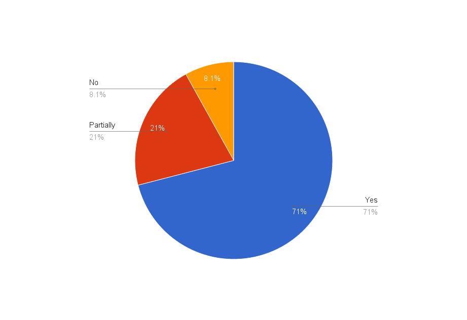

# Pattern Mobile Audit - Results

## Findings
Of the patterns that we audited, we found the following results:

| Widget Name   | Responsive?
| ------------- | -------------
| Accordians    | Yes
| Alerts        | Yes
| Badges        | Yes
| Empty State   | Yes
| Bootstrap - Comobobox | Yes
| Bootstrap - Datepicker | Yes
| Bootstrap Touchspin | Yes
| Breadcrumbs   | Yes
| Buttons       | Yes
| Card View - Card Variations | Yes
| Code          | Yes
| Dropdowns     | No
| Forms         | Yes
| Icons         | Yes
| Info Tip      | Yes
| Labels        | Yes
| List Group    | Yes
| List View Rows  | Yes
| Modals        | Yes
| Navbar        | Partially
| Pagination    | Yes
| Panels        | Yes
| Popovers      | Partially
| Progress Bars | Yes
| Search        | Yes
| Spinner       | Yes
| Table View w/Navbar | Partially
| Table View    | No
| Tables        | Yes
| Tabs          | Partially
| Time Picker   | Partially
| Toast Notifications | Partially
| Toolbar       | Yes
| Tooltip       | No
| Typography    | No
| Wizard        | Yes
| Area Charts   | Yes
| Bar Charts    | Yes
| Donuts Charts | Yes
| Line Charts   | Yes
| Pie Charts    | Yes
| Utilization Bar Charts | Yes
| Basic         | Yes
| Tree View     | Yes
| Card View - Multi Select | Yes
| Card View - Single Select | Yes
| Cards         | Yes
| Dashboard     | Yes
| Forms         | Yes
| List View - Compound Expansion | Partially
| List View - Simple Expansion | Partially
| List View     | Partially
| Login         | Partially
| Notification Drawer for Horizontal Navigation | Partially
| Notification Drawer for Vertical Navigation | Partially
| Tab           | Partially
| Typography    | No
| Horizontal Navigation | Yes
| Vertical Navigation w/Primary Only | Yes
| Vertical Navigation w/Tertiary Navigation (badges) | Yes
| Vertical Navigation w/Secondary | Yes
| Vertical Navigation w/Tertiary Navigation (no icons) | Yes
| Vertical Navigation w/Tertiary Navigation (pinnable) | Yes

For a full breakdown of our findings, [view the PDF](MobileChecklist_PFPatterns.pdf).

## Breakdown

* 44 patterns found to be responsive
* 13 patterns found to be partially responsive
* 5 patterns found not to be responsive

