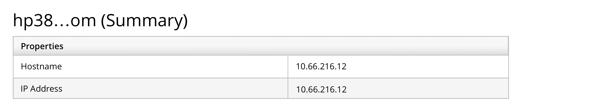
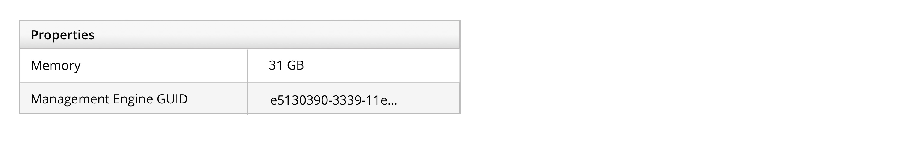
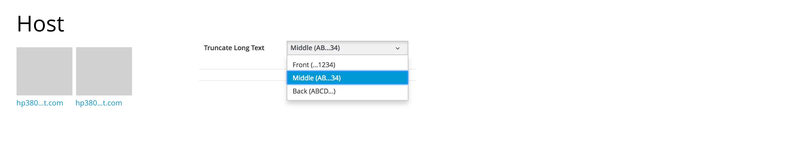
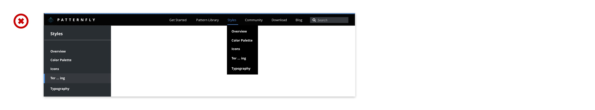
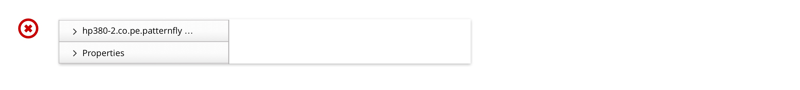
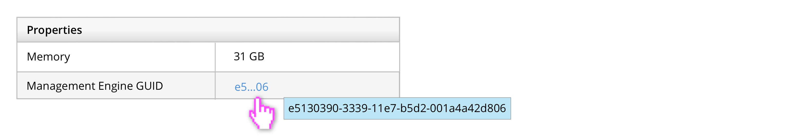
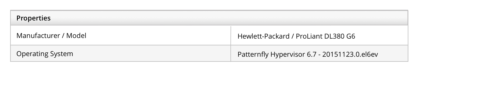

# Terminology and Wording

## Index
1. [Common Terms and Words](#common-terms-and-words)
1. [Abbreviations](#abbreviations)
1. [Acronyms](#acronyms)
1. [Capitalization](#capitalization)
1. [Links](#links)
1. [Punctuation](#punctuation)
1. [Truncation](#truncation)

## Common Terms and Words
- Login (adj): As in a Login page. It also could be use as a noun as another name for username. However, "username" is recommended.
- Log in (v): Use "Log In" as the button label for the Login page.
- Username (n): Usually a unique ID (e.g. ssmith123). Use "username" for the product login screen.

### Terminology and Wording for Action Labels

| Label |	Action | Complement	| Notes |
| ----- | ------ | ---------- | ----- |
| Add or Add [Object] |	Add an existing item to an existing list, group, view, or other container element	| Remove | If what you are adding is not readily apparent from the context,consider adding a noun to the button label (e.g. Add User). Do not use Add to mean create a new item. See Create. |
| Change | Not recommended. See Edit | | |		
| Create or Create [Object]	| Create something new | Delete | If what you are creating is not readily apparent from the context, consider adding a noun to the button label (e.g. Create User). "New" or "Add" are not recommended for this use case. See "Add" for usage guidelines. |
| Delete | Removes the selected items. | Create	| Provide a mechanism to delete an object. "Erase" and "Remove" are not recommended for this use case. See Remove for usage guidelines. |
| Edit | A way to make changes to an object such as a file, configuration, policy, etc.). Also see Rename. | | Use Edit to provide a facility for making changes to an object the user selects. "Modify" and "Change" are not recommended for this use case. |
| Change | Not recommended. See Edit | | |
| New | Not recommended. See Add or Create | | |
| Remove or Remove [Object] |	Remove an item from a list, group, view, or other  container element without deleting the item. Also see  Add and Delete. | Add | If what you are removing is not readily apparent from the context, consider adding a noun to the button label (e.g, Remove File, Remove User). |

## Abbreviations

### General Rules
- Use abbreviations that users are familiar with and write out uncommon abbreviations.
- Do not write out units of measurement.
- Use abbreviations consistently.

### Common Abbreviations
| Abbreviation  | Usage |
| ------------- | ----- |
| e.g. and i.e. | Use sparingly. e.g. means “for example.” i.e. means “in other words.” Add commas after each (e.g.,).Adapted from Red Hat Corporate Style Guide |
| KVM	          | kernel-based virtual machine |
| sysadmin      | Avoid using abbreviations like "sysadmin" and "SysAdmin;" these are too informal. "System" should be singular (i.e., not "systems administrator"), because it can include both a single system and multiple systems, similar to "database administrator" or "brain surgeon," who work on more than one database and brain, respectively.Taken from Red Hat Corporate Style Guide.|
| U.S.          | As a noun, use "United States" unless there are space constraints. As an adjective use "U.S." (e.g., U.S. soldier). As part of an organization, use "U.S." Taken from Red Hat Corporate Style Guide. |
| VM            | virtual machine.  OK to abbreviate as long as you've spelled it out once in first occurrence and as long as "VM" won't be confused with other terms that share that acronym.Taken from Red Hat Corporate Style Guide. |

### Abbreviations for 12 hour Time System

When referring to time zones, use this chart: http://www.timeanddate.com/time/zones/

<table>
  <tr>
    <td>AM</td>
    <td>ante meridiem (before noon)</td>
  </tr>
  <tr>
    <td>PM</td>
    <td>post meridiem (after noon)</td>
  </tr>
</table>

## Acronyms

### General Rules
- Use acronyms that users are familiar with and write out uncommon acronyms
- Use acronyms consistently.

## Capitalization

### Headline style

For headline style, capitalize the first letter of every word except for articles (a, an, the), coordinating conjunctions (and, but, or), and prepositions of three letters or fewer (of, on, by, in). There’s one exception: Any word that is the first word in the headline or the last word should be capitalized, regardless of its part of speech. For example, “Where to Install”

### Sentence style

For sentence style, capitalize the first letter of the first word and any proper nouns.  Use sentence style for blocks of text and as described in “Capitalization for Common Components.” For example, “Only show subscriptions that match this Subscription Asset Manager Organization.”

### Capitalization for Common Components
| Component                                                  | Capitalization |
| ---------------------------------------------------------- | -------------- |
| Button labels                                              | Headline       |
| Checkbox labels                                            | Sentence       |
| Column heading labels                                      | Headline       |
| Error messages                                             | Sentence       |
| Group headings, group boxes                                | Headline       |
| List boxes: Introductory text                              | Sentence       |
| List boxes: List box labels                                | Headline       |
| Menu items                                                 | Headline       |
| Prompts                                                    | Sentence       |
| Radio buttons labels                                       | Sentence       |
| States (as shown in tables, filters, e. g. Up and Running) | Headline       |
| Status messages                                            | Sentence       |
| Tab labels                                                 | Headline       |
| Text box labels                                            | Headline       |
| Tooltips                                                   | Sentence       |
| Window titles (browsers, dialog boxes, steps in a wizard)  | Headline       |

## Links

### More Information Link

As a user, I want to see a single link that directs me to a page or document with additional information to learn more about a particular subject or task. As the user is reading the sentence, they have the option to click on the documentation or page link to view the documentation. This documentation could live within the same site or outside of the site. If it lives outside the site, we should let the user know by adding an icon to make this clear.

### General Rules
- The link should be included in a complete sentence, use punctuation and sentence style capitalization.
- Names or titles of a document or page should use header style capitalization.
- The name of the document should should use link text styling to indicate that it is clickable. Check out an example of the link text under Styles Samples on the Typography page.
- Some recommendations for wording include:
  - View [Document Link] for more information.
  - View ‘X’ in [Document Link] for more information.

## Punctuation
| Symbol | Usage |
| ------ | ----- |
| Ampersands | Avoid using ampersands.  Use “and” instead. |
| Colon	| Use sentence style capitalization for introductory text that appears above a control. A colon follows the introductory text. |
| Comma	| Use serial commas. A serial comma is the comma before the “and” in a series of three or more items: “Item 1, item 2, and item 3.”Taken from Red Hat Word Nerds. |
| Currency | For currencies that use the symbol $ alone, modify with the first two letters of the ISO code. Eg: US$1,500 (United States), AU$1,500 (Australia), HK$1,500 (Hong Kong), CA$1,500 (Canada). For other currencies, use the national currency symbol whenever possible (£1,500 = British pound; €1,500 = Euro, ¥1,500 = Japanese Yen, etc.). Generally, we do not provide currency conversions.Taken from Red Hat Corporate Style Guide.
| Ellipses | Use an ellipsis (...) to indicate that text is truncated.
| Exclamation point | Avoid using exclamation points, except when referring to a command, such as the bang ( ! ) command.
| Hyphenation	| Hyphenate when needed for clarity. Words that begin with prefixes are usually not hyphenated.  Prefixes can include "multi," "non," "sub," "co," "semi," "pre," "re," etc. * **Exceptions:** When not hyphenating makes it unclear. For example: He recovered his health. He re-covered the leaky roof.* (AP)You will usually hyphenate:<ul><li> Complex adjectives (compound modifiers). This is when two adjectives work together to modify an object. The hyphen is used when the first adjective modifies the second adjective. Examples: cloud-based solutions, right-side paralysis, system-wide menu.  * **Exception:** We never hyphenate "open source," even when used as a complex adjective.* </li><li>When the prefix ends in a vowel and the word that follows begins with the same vowel. Examples: semi-independent, pre-emptive. Exceptions: cooperate, coordinate</li><li>Capitalized words with a prefix.  Examples:  un-American, non-British</li><li>Double prefixes. Examples: sub-subparagraph, re-sublet</li></ul> Do not hyphenate words with the prefix “non” unless the dictionary says otherwise: nonaddictive, nonabrasive, nonalcoholic. Taken from Red Hat Corporate Style Guide |
| Percent | In text, use the word percent. For example: 10 percent to 20 percent. In tables, use the percent symbol. For example: 10% to 20% |
| Question mark	| Place a question mark at the end of a question. For example: Are you sure you want to delete this file? |

## Truncation

### Instances where text might need to be truncated.

  -  Whenever the string overflows the container and you don't want the text to overflow to multiples lines. A few examples include:
    - Page titles that show object/host names

    - Table or list view cells that contain long strings or lots of data and that have some method to view the full text

### Whether to design for truncating strings at the beginning, end, or in the middle requires a bit of research.

  - Does the product you are designing for have a default truncation scheme? (For example, if your product has a default setting for how to truncate host names but also a user preference if users want to change it to suit their naming scheme, you should follow that scheme along with the guidelines here.
    

  - If the product doesn't have a default truncation choice, think about how the product's users are apt to name objects -- is it more likely that the unique part of the name will be at the beginning or end of the string? Based on the answer, we recommend one of two methods of truncation. There are two different methods that could be applied. One is to truncate at the end of the string "abcdef..." and the other would be to truncate in the middle of the string "abc...ghi". Choose the method on the basis of whether text at the end or in the middle of the string is more likely to differentiate the item.

### Additional truncation guidelines.

  - Avoid abbreviations or truncated text in navigation items (first, second, and third levels of navigation in the masthead; left navigation).

  

  - In any container holding a string, if there is not sufficient room for the full spelling or hyphenated word, consider abbreviating the text. For abbreviations, visit "Common Abbreviations" under [Terminology and Wording](http://www.patternfly.org/styles/terminology-and-wording/) or reference the [Chicago Manual](http://www.chicagomanualofstyle.org/16/ch10/ch10_toc.html) of Style. Do not truncate text in column headings.

  

  - Indicate truncated text with an ellipsis (…).  If the text is part of a link, the ellipsis should be part of the link as well.

    

  - Leave no fewer than 4 characters when truncating text, and preferably leave enough characters to give a fair idea of what the string says.  For example, don't truncate demo1.internal-el6.satellite to de...
  - Ensure that there is at least one method for the user to view the entire string.  We recommend the use of a [tooltip](https://www.patternfly.org/pattern-library/widgets/#tooltip) (useful for less than 150 characters or so), but other options include: expanding rows and overlays.

  

  - For UI text (as opposed to user-generated text), keep in mind that some truncation could cause awkward words (i.e. "associate" truncating to "ass...") Attempt to avoid these scenarios, if possible.
  - If possible, ensure that truncation does not happen after punctuation, because then it is difficult to differentiate which is the ellipsis and which is part of the name.  For example, don't truncate demo1.internal-el6.satellite to demo1….
  - If a table column is resizable, the truncated text should adjust accordingly, and continue to follow the preceding guidelines.

  Large size:
  

  Small size:
  
