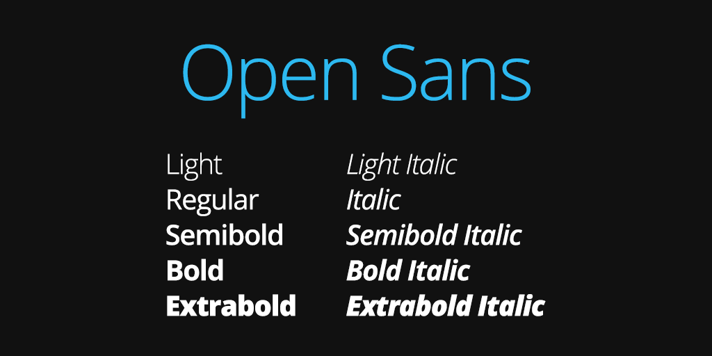

# Typography

PatternFly uses Open Sans, an open-licensed, sans serif, typeface designed by Steve Matteson. The type family includes a complete 897 character set, along with Cyrillic character sets. There are ten type-face variants available with this font. Use the CSS rule “@font-face” to include these fonts in your application styles. For more information, check out [Mozilla Developer Network's @font-face Summary](https://developer.mozilla.org/en-US/docs/Web/CSS/@font-face).

___

## Typographic Styles

The below style samples represent commonly-used typographic layouts. Check out more samples including `<dd>/<dl>` description lists, alignment classes, unstyled lists, and inline lists, here: [PatternFly Typography test page](https://patternfly.github.io/patternfly-3/tests/typography-2.html).

# Application Heading h1

## Level 2 Heading h2

### Level 3 Heading h3

Small Text

Body Copy

_Italicized (Emphasized) Body Copy_

**Bolded Body Copy**

[Text Link](http://www.patternfly.org/styles/typography/#_)

| Style                  | Point Size | Weight        | Line Height | Usage                                                                                            |
|------------------------|------------|---------------|-------------|--------------------------------------------------------------------------------------------------|
| Application Header h1  | 24         | 300 (Light)   | 1.1em       | Only to be used in the Application Name at Top of Screen                                         |
| Level 2 Header h2      | 22         | 300 (Light)   | 1.1em       | Only to be used in the Second-Level Headers.                                                     |
| Level 3 Header h3      | 16         | 500 (Regular) | 1.1em       | Only to be used in the Third-Level Headers.                                                      |
| Lead Body Copy         | 13         | 300 (Light)   | 1.4em       | Should only be used before regular body text, for larger ideas or descriptions before real data. |
| Body Copy              | 12         | 500 (Regular) | 1.666em     | This base font size is used for all content and data, with the exception of Lead Body Copy.      |
| Body Copy (Bolded)     | 12         | 700 (Bold)    | 1.666em     | This should be used for descriptors, and for emphasized text.                                    |
| Body Copy (Italicized) | 12         | Italic        | 1.666em     | Italics should be used sparingly. See the PatternFly Typography test page for an example.        |
| Link Text              | 12         | 500 (Regular) | 1.666em     | Link text should always be blue (#0088ce), and should never be underlined.                       |
| Small Text             | 10         | 500 (Regular) | 1.666em     | This is the minimum font size. Use sparingly, only as needed.                                                                   |
___

## List Styles

#### Unordered List

* Lorem Ipsum
  * Lorem
    * Adipiscing
    * Elit
  * Ipsum
* Lorem Ipsumus
* Lorem Ipsumus Amet

#### Ordered List

1. Lorem Ipsum
1. Adipiscing Elitus
1. Ipsumus Amet
1. Consectetur

___

## Color Usage

| Style 	| Color (Hex#) 	| Usage 	|
|---------------	|--------------	|------------------------------------------------------------------------	|
| Regular Copy 	| #363636 	| This text color is used as often as possible, and always on body text. 	|
| Text Links 	| #0088ce 	| This color is reserved only for links. 	|
| Disabled Text 	| #9c9c9c 	| This color is reserved for disabled text. 	|
